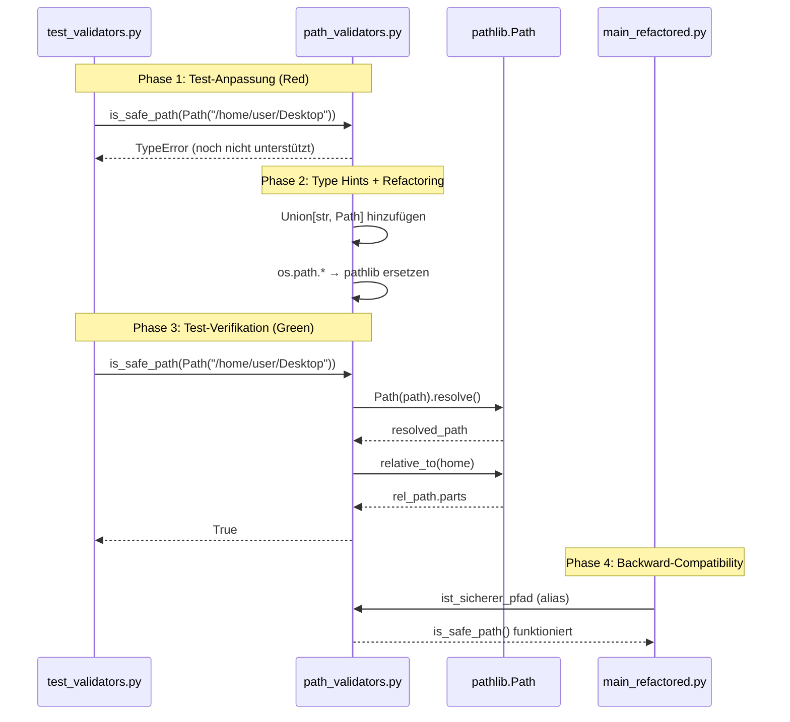

I have created the following plan after thorough exploration and analysis of the codebase. Follow the below plan verbatim. Trust the files and references. Do not re-verify what's written in the plan. Explore only when absolutely necessary. First implement all the proposed file changes and then I'll review all the changes together at the end.

## Beobachtungen zur Codebase

Das Modul `file:folder_extractor/utils/path_validators.py` verwendet aktuell `os.path.abspath()`, `os.path.relpath()`, `os.sep` und `os.path.expanduser()`. Es importiert bereits `pathlib.Path`, nutzt es aber nur für `Path.home()`. Die Funktionen akzeptieren `str`-Parameter und werden in `file:folder_extractor/core/extractor.py` und `file:folder_extractor/core/extractor_v2.py` verwendet. Die Tests in `file:tests/unit/test_validators.py` übergeben String-Pfade, konstruieren diese aber intern mit `Path`-Objekten. Ein Backward-Compatibility-Test importiert `ist_sicherer_pfad` aus `folder_extractor.main` (aliased in `file:folder_extractor/main_refactored.py`).

## Ansatz

Der Refactoring-Ansatz folgt strikt TDD: Zuerst werden die Tests angepasst, um sowohl `str` als auch `Path`-Objekte zu akzeptieren (Red-Phase). Dann wird der Produktivcode auf `pathlib` umgestellt (Green-Phase). Die öffentlichen Schnittstellen erhalten `Union[str, Path]` Type Hints für API-Kompatibilität. Intern wird sofort zu `Path` konvertiert. Die Backward-Compatibility mit `ist_sicherer_pfad` bleibt durch den Alias in `main_refactored.py` erhalten. Nach jedem Schritt wird die Coverage mit `pytest --cov=folder_extractor.utils.path_validators --cov-fail-under=100` verifiziert.

## Implementierungsschritte

### 1. Test-Anpassung (TDD Red-Phase)

**Datei:** `file:tests/unit/test_validators.py`

Erweitere die Tests in der Klasse `TestPathValidators`, um sowohl String- als auch Path-Objekte zu testen:

- In `test_safe_path_compatibility()`: Füge zusätzliche Testfälle hinzu, die `Path`-Objekte direkt an `is_safe_path()` übergeben
- In `test_get_safe_path_info()`: Teste mit `Path(home / "Desktop" / "test")` zusätzlich zu String-Pfaden
- In `test_normalize_path()`: Teste mit `Path("~/Desktop")` und `Path("./test")`
- In `test_is_subdirectory()`: Teste mit `Path("/parent")` und `Path("/parent/child")`
- Füge einen neuen Test `test_path_object_acceptance()` hinzu, der explizit verifiziert, dass alle vier Funktionen `Path`-Objekte akzeptieren

Führe Tests aus: `pytest tests/unit/test_validators.py::TestPathValidators -v`

**Erwartetes Ergebnis:** Tests schlagen fehl (Red), da die Funktionen noch keine `Path`-Objekte akzeptieren.

### 2. Type Hints aktualisieren

**Datei:** `file:folder_extractor/utils/path_validators.py`

Ändere die Funktionssignaturen:

- `is_safe_path(path: Union[str, Path]) -> bool`
- `get_safe_path_info(path: Union[str, Path]) -> Tuple[bool, str]`
- `normalize_path(path: Union[str, Path]) -> str`
- `is_subdirectory(parent: Union[str, Path], child: Union[str, Path]) -> bool`

Füge Import hinzu: `from typing import Union`

### 3. Refactoring `is_safe_path()` auf pathlib

**Datei:** `file:folder_extractor/utils/path_validators.py`, Funktion `is_safe_path()`

Ersetze die Implementierung:

- Konvertiere Input zu `Path`: `path = Path(path)` am Anfang
- Ersetze `os.path.abspath(path)` durch `path.resolve()`
- Ersetze `str(Path.home())` durch `Path.home()`
- Ersetze `abs_path.startswith(home)` durch `try: path.resolve().relative_to(home)` (nutze Exception-Handling für "not relative")
- Ersetze `os.path.relpath(abs_path, home)` durch `path.resolve().relative_to(home)`
- Ersetze `rel_path.split(os.sep)` durch `rel_path.parts`
- Entferne `import os` wenn nicht mehr benötigt

**Logik:**
```
path = Path(path).resolve()
home = Path.home()
try:
    rel_path = path.relative_to(home)
    if rel_path.parts and rel_path.parts[0] in SAFE_FOLDER_NAMES:
        return True
except ValueError:
    return False
```

### 4. Refactoring `get_safe_path_info()` auf pathlib

**Datei:** `file:folder_extractor/utils/path_validators.py`, Funktion `get_safe_path_info()`

Analog zu `is_safe_path()`:

- Konvertiere Input: `path = Path(path).resolve()`
- Nutze `path.relative_to(home)` statt `os.path.relpath()`
- Nutze `.parts` statt `.split(os.sep)`
- Behandle `ValueError` für Pfade außerhalb von `home`

### 5. Refactoring `normalize_path()` auf pathlib

**Datei:** `file:folder_extractor/utils/path_validators.py`, Funktion `normalize_path()`

Vereinfache die Implementierung:

- Konvertiere Input: `path = Path(path)`
- Ersetze `os.path.expanduser(path)` durch `path.expanduser()`
- Ersetze `os.path.abspath()` durch `.resolve()`
- Return: `return str(path.expanduser().resolve())`

**Hinweis:** Rückgabe bleibt `str` für API-Kompatibilität.

### 6. Refactoring `is_subdirectory()` auf pathlib

**Datei:** `file:folder_extractor/utils/path_validators.py`, Funktion `is_subdirectory()`

Nutze `pathlib`-Methoden:

- Konvertiere beide Inputs zu `Path` und normalisiere mit `normalize_path()`
- Ersetze `os.path.relpath(child, parent)` durch `Path(child).relative_to(Path(parent))`
- Nutze Exception-Handling für `ValueError` (nicht verwandt)

**Logik:**
```
parent_path = Path(normalize_path(parent))
child_path = Path(normalize_path(child))
try:
    child_path.relative_to(parent_path)
    return True
except ValueError:
    return False
```

### 7. Import-Bereinigung

**Datei:** `file:folder_extractor/utils/path_validators.py`

- Entferne `import os` vollständig
- Behalte `from pathlib import Path`
- Füge `from typing import Union, Tuple` hinzu (falls noch nicht vorhanden)

### 8. Test-Verifikation (TDD Green-Phase)

Führe Tests aus:

```bash
pytest tests/unit/test_validators.py::TestPathValidators -v
pytest --cov=folder_extractor.utils.path_validators --cov-report=term-missing --cov-fail-under=100
```

**Erwartetes Ergebnis:** Alle Tests grün, 100% Coverage.

### 9. Integration-Test mit abhängigen Modulen

Führe Tests der Module aus, die `path_validators` verwenden:

```bash
pytest tests/unit/test_core_extractor.py -v
pytest tests/unit/test_file_operations.py -v
```

**Erwartetes Ergebnis:** Alle Tests grün, keine Regressionen.

### 10. Backward-Compatibility-Verifikation

**Datei:** `file:folder_extractor/main_refactored.py`

Verifiziere, dass der Alias `ist_sicherer_pfad` weiterhin funktioniert:

```bash
pytest tests/unit/test_validators.py::TestPathValidators::test_safe_path_compatibility -v
pytest tests/unit/test_file_operations.py -k "ist_sicherer_pfad" -v
```

**Erwartetes Ergebnis:** Backward-Compatibility-Tests bestehen.

### 11. Finale Coverage-Prüfung

```bash
pytest tests/unit/test_validators.py -v --cov=folder_extractor.utils.path_validators --cov-report=term-missing --cov-fail-under=100
```

**Definition of Done:**
- ✅ Alle Tests in `test_validators.py` grün
- ✅ 100% Coverage für `path_validators.py`
- ✅ Keine `os.path.*` oder `os.sep` Verwendung mehr
- ✅ Type Hints mit `Union[str, Path]` an öffentlichen Schnittstellen
- ✅ Backward-Compatibility mit `ist_sicherer_pfad` erhalten
- ✅ Keine Regressionen in abhängigen Modulen

## Architektur-Übersicht



## Mapping: os.path → pathlib

| os.path Methode | pathlib Äquivalent | Verwendung in |
|-----------------|-------------------|---------------|
| `os.path.abspath(path)` | `Path(path).resolve()` | `is_safe_path()`, `get_safe_path_info()`, `normalize_path()` |
| `os.path.relpath(path, start)` | `Path(path).relative_to(start)` | `is_safe_path()`, `get_safe_path_info()`, `is_subdirectory()` |
| `os.sep` | `Path.parts` | `is_safe_path()`, `get_safe_path_info()` |
| `os.path.expanduser(path)` | `Path(path).expanduser()` | `normalize_path()` |
| `str(Path.home())` | `Path.home()` | `is_safe_path()`, `get_safe_path_info()` |