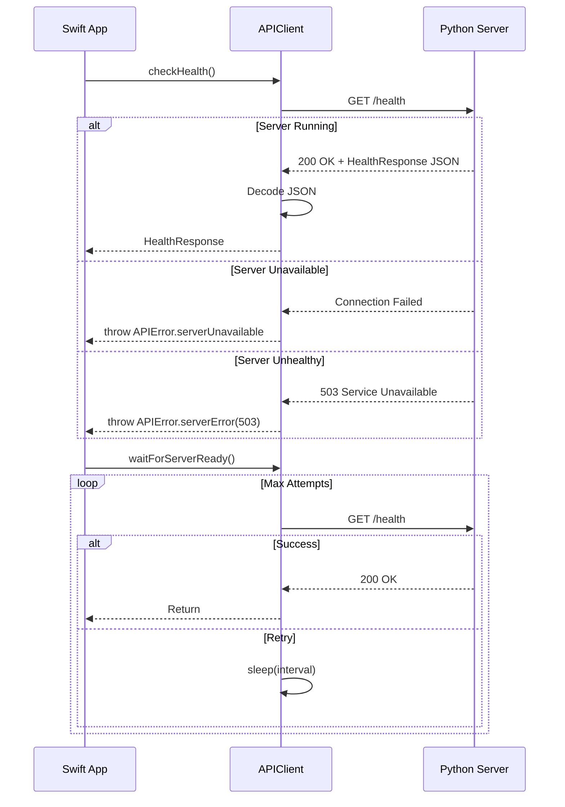

I have created the following plan after thorough exploration and analysis of the codebase. Follow the below plan verbatim. Trust the files and references. Do not re-verify what's written in the plan. Explore only when absolutely necessary. First implement all the proposed file changes and then I'll review all the changes together at the end.

## Beobachtungen

Der Python-API-Server läuft auf `localhost:23456` (konfigurierbar via `API_HOST`/`API_PORT` Umgebungsvariablen) und bietet einen `/health` Endpoint, der eine strukturierte `HealthResponse` zurückgibt. Der Endpoint antwortet mit HTTP 200 bei Status "healthy" oder "degraded" und HTTP 503 bei "unhealthy". Die API nutzt FastAPI mit async/await Patterns und CORS ist für localhost-Origins konfiguriert. Die HealthResponse enthält Felder für `status`, `version`, `database` und `smart_sorter`.

## Ansatz

Erstelle eine Swift-Klasse `APIClient`, die URLSession für HTTP-Requests nutzt und moderne async/await Patterns implementiert. Die Klasse kapselt die Kommunikation mit dem Python-Backend und bietet eine typsichere `checkHealth()` Methode, die periodisch den `/health` Endpoint abfragt. Implementiere strukturiertes Error Handling für Netzwerk-, Parsing- und Server-Fehler sowie konfigurierbare Timeouts. Die Response-Struktur wird als Swift Codable Struct modelliert, um die JSON-Antwort des Servers zu deserialisieren.

## Implementierungsschritte

### 1. Response-Modell definieren

Erstelle in `file:swift/APIClient.swift` ein Swift `struct HealthResponse: Codable` mit Properties:
- `status: String` - Gesamtstatus ("healthy", "degraded", "unhealthy")
- `version: String` - API-Version
- `database: String` - Datenbank-Status
- `smartSorter: String` - SmartSorter-Status (mit `CodingKeys` für snake_case Mapping zu `smart_sorter`)

### 2. Error-Typen definieren

Erstelle ein `enum APIError: Error` mit Cases:
- `networkError(Error)` - Netzwerkfehler (z.B. keine Verbindung)
- `invalidResponse` - Ungültige HTTP-Response
- `serverError(Int)` - Server-Fehler mit HTTP-Statuscode
- `decodingError(Error)` - JSON-Parsing-Fehler
- `timeout` - Request-Timeout
- `serverUnavailable` - Server nicht erreichbar (HTTP 503)

### 3. APIClient-Klasse implementieren

Erstelle `class APIClient` mit:
- Private Property `baseURL: URL` (initialisiert mit `http://127.0.0.1:23456`)
- Private Property `session: URLSession` mit konfiguriertem Timeout (z.B. 5 Sekunden)
- Initializer, der optional eine custom `baseURL` akzeptiert
- Private Methode `performRequest<T: Decodable>(_ endpoint: String) async throws -> T` für generische HTTP-Requests

### 4. Health Check Methode

Implementiere `func checkHealth() async throws -> HealthResponse`:
- Erstelle URLRequest für `/health` Endpoint
- Nutze `URLSession.data(for:)` mit async/await
- Prüfe HTTP-Statuscode (200 = OK, 503 = degraded/unhealthy, andere = Fehler)
- Deserialisiere JSON-Response zu `HealthResponse` mit `JSONDecoder`
- Werfe entsprechende `APIError` bei Fehlern
- Logge Requests/Responses für Debugging (optional mit `os.log`)

### 5. Timeout-Konfiguration

Konfiguriere `URLSessionConfiguration` mit:
- `timeoutIntervalForRequest: 5.0` - Request-Timeout
- `timeoutIntervalForResource: 10.0` - Gesamt-Timeout
- `waitsForConnectivity: false` - Sofortiger Fehler bei fehlender Konnektivität

### 6. Convenience-Methoden

Füge Helper-Methoden hinzu:
- `func isServerHealthy() async -> Bool` - Vereinfachte Health-Check-Methode, die nur true/false zurückgibt
- `func waitForServerReady(maxAttempts: Int, interval: TimeInterval) async throws` - Polling-Methode, die wartet bis Server bereit ist

### 7. Dokumentation

Füge DocC-kompatible Kommentare hinzu für:
- Klassen-Übersicht mit Usage-Beispiel
- Alle public Methoden mit Parameters, Returns und Throws
- Error-Cases mit Beschreibungen

## Architektur-Diagramm

## Dateistruktur

| Datei | Zweck |
|-------|-------|
| `file:swift/APIClient.swift` | HTTP-Client für Backend-Kommunikation |
| `file:swift/BackendManager.swift` | Prozess-Management (bereits erstellt) |