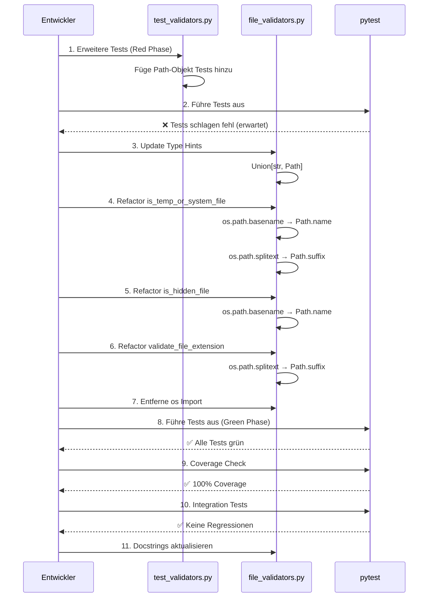

I have created the following plan after thorough exploration and analysis of the codebase. Follow the plan, but verify critical assumptions during implementation (e.g., path handling differences when switching from os.path to pathlib). First implement all the proposed file changes and then I'll review all the changes together at the end.

## Beobachtungen

Das Modul `file_validators.py` nutzt aktuell `os.path.basename()` (Zeilen 37, 111) und `os.path.splitext()` (Zeilen 49, 156) für Pfadoperationen. Die Funktion `is_git_path()` verwendet bereits `Path(path).parts`, was zeigt, dass pathlib teilweise integriert ist. Die Tests in `test_validators.py` übergeben ausschließlich Strings und verwenden keine Mocks für `os.path`-Funktionen. Die Funktionen werden in `file_discovery.py` und `main_refactored.py` verwendet, was bedeutet, dass die Signaturen kompatibel bleiben müssen.

## Ansatz

Der Refactoring-Ansatz folgt dem strikten TDD-Prinzip: Zuerst werden die Tests angepasst, um sowohl String- als auch Path-Eingaben zu testen, dann wird der Produktivcode refactored. Die Signaturen werden auf `Union[str, Path]` geändert, um Abwärtskompatibilität zu gewährleisten. Intern werden alle Pfade in Path-Objekte konvertiert und mit pathlib-Methoden verarbeitet. Die Änderungen sind minimal-invasiv und fokussieren sich ausschließlich auf die Ersetzung von `os.path.basename()` durch `Path.name` und `os.path.splitext()` durch `Path.suffix`/`Path.stem`.

## Implementierungsschritte

### 1. TDD Red Phase - Tests erweitern

**Datei:** `file:tests/unit/test_validators.py`

Erweitere die bestehenden Tests in der Klasse `TestFileValidators`, um sowohl String- als auch Path-Objekte zu testen:

- **`test_temp_system_file_detection`**: Füge zusätzliche Assertions hinzu, die Path-Objekte übergeben (z.B. `Path(".DS_Store")`, `Path("document.pdf")`)
- **`test_is_hidden_file`**: Teste mit Path-Objekten zusätzlich zu Strings
- **`test_validate_file_extension`**: Teste mit Path-Objekten für alle Szenarien (ohne Filter, mit Filter, mehrere Extensions)

Füge einen neuen Test hinzu:
- **`test_path_object_compatibility`**: Verifiziere, dass alle Funktionen (`is_temp_or_system_file`, `is_hidden_file`, `validate_file_extension`) identische Ergebnisse für String- und Path-Eingaben liefern

```python
def test_path_object_compatibility(self):
    """Test that functions work with both str and Path objects."""
    test_cases = [
        (".DS_Store", True),
        ("document.pdf", False),
        (".hidden", True),
        ("normal.txt", False)
    ]
    
    for filename, expected in test_cases:
        assert is_temp_or_system_file(filename) == expected
        assert is_temp_or_system_file(Path(filename)) == expected
        assert is_hidden_file(filename) == is_hidden_file(Path(filename))
```

### 2. Refactor - Type Hints aktualisieren

**Datei:** `file:folder_extractor/utils/file_validators.py`

Ändere die Importe und Type Hints:

```python
from typing import Optional, Union
from pathlib import Path
```

Aktualisiere die Funktionssignaturen:
- `is_temp_or_system_file(filename: Union[str, Path]) -> bool`
- `is_git_path(path: Union[str, Path]) -> bool` (bereits Path-kompatibel)
- `is_hidden_file(path: Union[str, Path]) -> bool`
- `should_include_file(filepath: Union[str, Path], include_hidden: bool = False) -> bool`
- `validate_file_extension(filepath: Union[str, Path], allowed_extensions: Optional[list] = None) -> bool`

### 3. Refactor - `is_temp_or_system_file()` auf pathlib umstellen

**Datei:** `file:folder_extractor/utils/file_validators.py` (Zeilen 21-78)

Ersetze die Implementierung:

```python
def is_temp_or_system_file(filename: Union[str, Path]) -> bool:
    # Konvertiere zu Path-Objekt
    path = Path(filename)
    basename = path.name  # Ersetzt os.path.basename()
    name_lower = basename.lower()
    
    # Check exact matches first
    if basename in SYSTEM_FILES or basename in GIT_TEMP_FILES:
        return True
    
    # Check lowercase matches
    if name_lower in {f.lower() for f in SYSTEM_FILES}:
        return True
    
    # Check extensions - verwende Path.suffix
    # HINWEIS: Path.suffix gibt ".tmp" zurück (MIT führendem Punkt)
    # TEMP_EXTENSIONS ist bereits mit Punkten definiert: {".tmp", ".temp", ...}
    ext = path.suffix.lower()  # Ersetzt os.path.splitext()
    if ext in TEMP_EXTENSIONS:
        return True

    # Rest der Logik bleibt unverändert (Pattern-Matching)
    # ...
```

**Wichtig**: `Path.suffix` gibt `.tmp` zurück (mit Punkt), während `os.path.splitext()` `('file', '.tmp')` zurückgibt. Da `TEMP_EXTENSIONS` bereits mit führenden Punkten definiert ist (`{".tmp", ".temp", ...}`), funktioniert der direkte Vergleich korrekt.

### 4. Refactor - `is_hidden_file()` auf pathlib umstellen

**Datei:** `file:folder_extractor/utils/file_validators.py` (Zeilen 101-113)

```python
def is_hidden_file(path: Union[str, Path]) -> bool:
    path_obj = Path(path)
    basename = path_obj.name  # Ersetzt os.path.basename()
    return basename.startswith(HIDDEN_FILE_PREFIX) and basename not in ['.', '..']
```

### 5. Refactor - `validate_file_extension()` auf pathlib umstellen

**Datei:** `file:folder_extractor/utils/file_validators.py` (Zeilen 142-157)

```python
def validate_file_extension(filepath: Union[str, Path], allowed_extensions: Optional[list] = None) -> bool:
    """Check if file has an allowed extension.

    Args:
        filepath: Path to the file (str or Path object).
        allowed_extensions: List of allowed extensions. Accepts both formats:
            - With leading dot: ['.txt', '.pdf', '.PDF']
            - Without leading dot: ['txt', 'pdf', 'PDF']
            Extensions are normalized internally to lowercase with leading dot.
            If None or empty, all extensions are allowed.

    Returns:
        True if extension is allowed or no filter is set, False otherwise.

    Note:
        Comparison is case-insensitive. Both '.PDF' and '.pdf' match 'file.Pdf'.

    Examples:
        >>> validate_file_extension('doc.pdf', ['.pdf'])
        True
        >>> validate_file_extension('doc.PDF', ['pdf'])  # case-insensitive, dot optional
        True
        >>> validate_file_extension(Path('image.png'), ['.jpg', '.jpeg'])
        False
    """
    if not allowed_extensions:
        return True

    path = Path(filepath)
    ext = path.suffix.lower()  # Gibt ".pdf" zurück (mit Punkt, lowercase)

    # Normalisiere allowed_extensions zu lowercase mit führendem Punkt
    # User könnte ".pdf", "pdf", ".PDF" oder "PDF" übergeben
    normalized_extensions = {
        e.lower() if e.startswith('.') else f'.{e.lower()}'
        for e in allowed_extensions
    }
    return ext in normalized_extensions
```

**Wichtig**: Da `allowed_extensions` vom User-Input kommt (CLI), wird intern normalisiert:
- Alle Extensions werden zu lowercase konvertiert
- Fehlende führende Punkte werden ergänzt (`.pdf` und `pdf` → `.pdf`)
- Der Vergleich ist dadurch case-insensitive und format-tolerant

### 6. Refactor - `should_include_file()` anpassen

**Datei:** `file:folder_extractor/utils/file_validators.py` (Zeilen 116-139)

Die Funktion ruft bereits die anderen Funktionen auf, daher ist keine Änderung nötig außer der Signatur:

```python
def should_include_file(filepath: Union[str, Path], include_hidden: bool = False) -> bool:
    # Keine Änderung der Implementierung nötig
    # Die aufgerufenen Funktionen sind bereits pathlib-kompatibel
```

### 7. Entferne `os` Import

**Datei:** `file:folder_extractor/utils/file_validators.py` (Zeile 7)

Entferne `import os`, da es nicht mehr benötigt wird.

### 8. TDD Green Phase - Tests ausführen

Führe die Tests aus:

```bash
pytest tests/unit/test_validators.py::TestFileValidators -v
```

Stelle sicher, dass alle Tests grün sind. Falls Tests fehlschlagen:
- Überprüfe die Suffix-Logik (`.tmp` vs `tmp`)
- Verifiziere, dass `Path.name` korrekt funktioniert für relative und absolute Pfade
- Teste Edge Cases (leere Strings, `.`, `..`)
- Teste `validate_file_extension` mit beiden Varianten: `[".pdf"]` und `["pdf"]`

### 9. Coverage-Verifikation

Führe Coverage-Check aus:

```bash
pytest --cov=folder_extractor.utils.file_validators --cov-report=term-missing --cov-fail-under=100 tests/unit/test_validators.py::TestFileValidators
```

Falls Coverage < 100%:
- Identifiziere nicht abgedeckte Zeilen
- Füge fehlende Tests hinzu (z.B. für Edge Cases wie `Path("")`, `Path(".")`)

### 10. Integration Tests

Führe alle Tests aus, um sicherzustellen, dass die Änderungen keine Regressionen verursachen:

```bash
pytest tests/unit/test_validators.py -v
pytest tests/unit/test_core_file_discovery.py -v  # Verwendet should_include_file
```

### 11. Dokumentation aktualisieren

**Datei:** `file:folder_extractor/utils/file_validators.py`

Aktualisiere die Docstrings:
- Ändere `Args: filename: Name of the file to check` zu `Args: filename: Name or Path of the file to check`
- Füge Beispiele mit Path-Objekten hinzu:

```python
Examples:
    >>> is_temp_or_system_file(".DS_Store")
    True
    >>> is_temp_or_system_file(Path("document.pdf"))
    False
```

## Zusammenfassung der Änderungen

| Funktion | Vorher | Nachher |
|----------|--------|---------|
| `is_temp_or_system_file` | `os.path.basename()`, `os.path.splitext()` | `Path.name`, `Path.suffix` (TEMP_EXTENSIONS hat bereits führende Punkte) |
| `is_hidden_file` | `os.path.basename()` | `Path.name` |
| `validate_file_extension` | `os.path.splitext()` | `Path.suffix` + Extension-Normalisierung (`.pdf`/`pdf` → `.pdf`) |
| `is_git_path` | Bereits `Path.parts` | Keine Änderung |
| `should_include_file` | Ruft andere Funktionen auf | Signatur-Update |

## Sequenzdiagramm



## Wichtige Hinweise

- **Suffix-Unterschied**: `Path.suffix` gibt `.tmp` zurück (mit Punkt), `os.path.splitext()` gibt `('file', '.tmp')` als Tuple zurück.
- **Extension-Konsistenz**:
  - `TEMP_EXTENSIONS` ist bereits mit führenden Punkten definiert (`{".tmp", ".temp", ...}`) → direkter Vergleich mit `Path.suffix` funktioniert
  - `allowed_extensions` (User-Input) muss normalisiert werden, da User `.pdf` oder `pdf` übergeben könnten
- **Leere Pfade**: `Path("")` hat `.name == ""`, während `os.path.basename("")` auch `""` zurückgibt - Verhalten ist identisch.
- **Absolute vs. Relative**: `Path.name` funktioniert für beide Pfadtypen korrekt.
- **Abwärtskompatibilität**: Durch `Union[str, Path]` bleiben alle bestehenden Aufrufe mit Strings funktionsfähig.