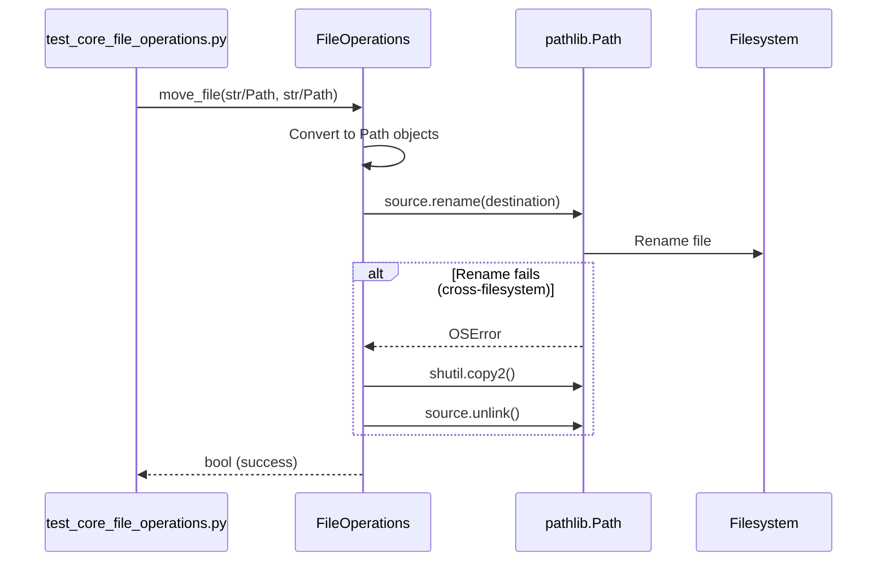

I have created the following plan after thorough exploration and analysis of the codebase. Follow the below plan verbatim. Trust the files and references. Do not re-verify what's written in the plan. Explore only when absolutely necessary. First implement all the proposed file changes and then I'll review all the changes together at the end.

## Beobachtungen zur Codebase

Die Datei `file_operations.py` verwendet aktuell intensiv `os` und `os.path` Methoden für Dateisystemoperationen. Es gibt bereits `pathlib.Path` Imports, aber diese werden nicht genutzt. Die Tests in `test_core_file_operations.py` verwenden bereits `Path`-Objekte und konvertieren diese zu Strings beim Aufruf der Methoden. Die Teststruktur ist gut organisiert mit `tempfile.TemporaryDirectory()` und nur einem Mock für `os.rename`. Die Klassen `FileOperations`, `HistoryManager` und `FileMover` sind klar getrennt und folgen dem Interface-Pattern (`IFileOperations`).

## Ansatz

Der Refactoring-Ansatz folgt strikt TDD: Zuerst werden die Tests angepasst, um Path-Objekte direkt zu verwenden und pathlib-Mocks zu erstellen. Dann wird der Produktivcode schrittweise refactored, wobei jede Methode einzeln umgestellt wird. Die Type Hints werden auf `Union[str, Path]` geändert, um Backward-Compatibility zu gewährleisten. Interne Konvertierung zu Path-Objekten erfolgt am Anfang jeder Methode. Die Verwendung von `tmp_path` Fixtures wird maximiert, um echte Filesystem-Tests zu bevorzugen. Nach jeder Änderung wird die Coverage geprüft.

## Implementierungsschritte

### 1. TDD Phase: Tests vorbereiten und anpassen

#### 1.1 Test-Fixtures auf pathlib umstellen
- In `test_core_file_operations.py` alle String-Konvertierungen (`str(source)`, `str(dest)`) entfernen
- Tests so anpassen, dass sie Path-Objekte direkt an die Methoden übergeben
- Sicherstellen, dass Tests auch mit String-Argumenten funktionieren (Backward-Compatibility)

#### 1.2 Mock für `os.rename` durch pathlib-Mock ersetzen
- Test `test_move_file_cross_filesystem` (Zeile 80-94): Ersetze `patch('os.rename')` durch `patch('pathlib.Path.rename')`
- Mock sollte `OSError` werfen, um Fallback auf copy+delete zu testen

#### 1.3 Neue Tests für Path-Objekte hinzufügen
- Teste explizit, dass Methoden sowohl `str` als auch `Path` akzeptieren
- Füge Tests hinzu für gemischte Verwendung (str source, Path destination)

### 2. Refactor Phase: `FileOperations` Klasse

#### 2.1 Type Hints aktualisieren
- Ändere alle Signaturen von `str` zu `Union[str, Path]`:
  - `move_file(source: Union[str, Path], destination: Union[str, Path], ...)`
  - `generate_unique_name(directory: Union[str, Path], filename: str)`
  - `remove_empty_directories(path: Union[str, Path], ...)`
  - `determine_type_folder(filename: Union[str, Path])`

#### 2.2 `move_file` Methode refactoren (Zeilen 63-92)
- Konvertiere `source` und `destination` zu Path-Objekten am Anfang
- Ersetze `os.rename(source, destination)` durch `Path(source).rename(destination)`
- Ersetze `shutil.copy2()` und `os.remove()` durch `Path.unlink()` nach copy
- Behalte `shutil.copy2()` für Metadaten-Erhaltung

#### 2.3 `generate_unique_name` Methode refactoren (Zeilen 94-125)
- Konvertiere `directory` zu Path-Objekt
- Ersetze `os.path.join(directory, filename)` durch `Path(directory) / filename`
- Ersetze `os.path.exists()` durch `Path.exists()`
- Nutze `Path.stem` und `Path.suffix` statt manueller String-Manipulation
- Return-Wert bleibt `str` für Kompatibilität

#### 2.4 `remove_empty_directories` Methode refactoren (Zeilen 127-172)
- Konvertiere `path` zu Path-Objekt
- Ersetze `os.walk(path, topdown=False)` durch `Path(path).rglob('*')` mit Filter für Directories
- Alternative: Nutze rekursive Funktion mit `Path.iterdir()`
- Ersetze `os.listdir(root)` durch `list(Path(root).iterdir())`
- Ersetze `os.path.join()` durch `/` Operator
- Ersetze `os.path.isfile()` und `os.path.isdir()` durch `Path.is_file()` und `Path.is_dir()`
- Ersetze `os.remove()` durch `Path.unlink()`
- Ersetze `shutil.rmtree()` durch rekursives Löschen oder behalte `shutil.rmtree()` mit Path
- Ersetze `os.rmdir()` durch `Path.rmdir()`

#### 2.5 `determine_type_folder` Methode refactoren (Zeilen 174-195)
- Konvertiere `filename` zu Path-Objekt falls nötig
- Ersetze `os.path.splitext()` durch `Path(filename).suffix`
- Nutze `Path.suffix.lower()` für Extension-Extraktion

### 3. Refactor Phase: `HistoryManager` Klasse

#### 3.1 `save_history` Methode refactoren (Zeilen 202-224)
- Konvertiere `directory` zu Path-Objekt
- Ersetze `os.path.join(directory, HISTORY_FILE_NAME)` durch `Path(directory) / HISTORY_FILE_NAME`
- Nutze `Path.open()` statt `open()` für konsistente API

#### 3.2 `load_history` Methode refactoren (Zeilen 227-246)
- Konvertiere `directory` zu Path-Objekt
- Ersetze `os.path.join()` durch `/` Operator
- Ersetze `os.path.exists()` durch `Path.exists()`
- Nutze `Path.open()` statt `open()`

#### 3.3 `delete_history` Methode refactoren (Zeilen 249-265)
- Konvertiere `directory` zu Path-Objekt
- Ersetze `os.path.join()` durch `/` Operator
- Ersetze `os.path.exists()` durch `Path.exists()`
- Ersetze `os.remove()` durch `Path.unlink()`

### 4. Refactor Phase: `FileMover` Klasse

#### 4.1 `move_files` Methode refactoren (Zeilen 282-340)
- Type Hints: `files: List[Union[str, Path]]`, `destination: Union[str, Path]`
- Konvertiere `destination` zu Path-Objekt
- Konvertiere `file_path` in der Loop zu Path-Objekt
- Ersetze `os.path.basename(file_path)` durch `Path(file_path).name`
- Ersetze `os.path.join(destination, unique_name)` durch `Path(destination) / unique_name`
- History-Records können Strings bleiben (für JSON-Serialisierung)

#### 4.2 `move_files_sorted` Methode refactoren (Zeilen 342-410)
- Type Hints: `files: List[Union[str, Path]]`, `destination: Union[str, Path]`
- Konvertiere `destination` zu Path-Objekt
- Konvertiere `file_path` in der Loop zu Path-Objekt
- Ersetze `os.path.basename()` durch `Path.name`
- Ersetze `os.path.join()` durch `/` Operator
- Ersetze `os.path.exists()` durch `Path.exists()`
- Ersetze `os.makedirs(type_path, exist_ok=True)` durch `Path(type_path).mkdir(parents=True, exist_ok=True)`

### 5. Imports aufräumen

- Entferne `import os` (behalte nur für `os.remove` falls noch benötigt)
- Stelle sicher, dass `from pathlib import Path` vorhanden ist
- Füge `from typing import Union` hinzu
- Prüfe, ob `shutil` noch benötigt wird (für `copy2` und `rmtree`)

### 6. Verification Phase

#### 6.1 Unit Tests ausführen
```bash
pytest tests/unit/test_core_file_operations.py -v
```

#### 6.2 Coverage prüfen
```bash
pytest tests/unit/test_core_file_operations.py --cov=folder_extractor.core.file_operations --cov-report=term-missing --cov-fail-under=100
```

#### 6.3 Alle Tests ausführen
```bash
pytest tests/unit/ -v
```

#### 6.4 Gesamte Coverage prüfen
```bash
pytest --cov=folder_extractor --cov-report=term-missing
```

### 7. Edge Cases und Kompatibilität

#### 7.1 String-zu-Path-Konvertierung
- Jede öffentliche Methode sollte am Anfang Parameter zu Path konvertieren:
  ```python
  def method(self, path: Union[str, Path]) -> ...:
      path = Path(path)
      # rest of implementation
  ```

#### 7.2 Return-Werte
- Methoden, die Pfade zurückgeben, sollten weiterhin Strings zurückgeben für Backward-Compatibility
- Nutze `str(path)` für Konvertierung zurück zu String

#### 7.3 Exception Handling
- `OSError` bleibt gleich (wird auch von pathlib geworfen)
- `FileOperationError` bleibt unverändert

## Architektur-Übersicht



## Refactoring-Mapping

| Alt (os/os.path) | Neu (pathlib.Path) | Notizen |
|------------------|-------------------|---------|
| `os.path.join(a, b)` | `Path(a) / b` | `/` Operator |
| `os.path.exists(p)` | `Path(p).exists()` | Methode |
| `os.path.basename(p)` | `Path(p).name` | Property |
| `os.path.splitext(p)` | `Path(p).suffix` | Property |
| `os.rename(s, d)` | `Path(s).rename(d)` | Methode |
| `os.makedirs(p)` | `Path(p).mkdir(parents=True, exist_ok=True)` | Methode |
| `os.listdir(p)` | `list(Path(p).iterdir())` | Generator |
| `os.walk(p)` | `Path(p).rglob('*')` | Rekursiv |
| `os.remove(p)` | `Path(p).unlink()` | Methode |
| `os.rmdir(p)` | `Path(p).rmdir()` | Methode |
| `os.path.isfile(p)` | `Path(p).is_file()` | Methode |
| `os.path.isdir(p)` | `Path(p).is_dir()` | Methode |
| `os.path.abspath(p)` | `Path(p).resolve()` | Methode |

## Definition of Done

- ✅ Alle Type Hints verwenden `Union[str, Path]` an öffentlichen Schnittstellen
- ✅ Keine `os.path.*` Aufrufe mehr in `file_operations.py`
- ✅ Alle Tests in `test_core_file_operations.py` laufen erfolgreich durch
- ✅ Coverage für `file_operations.py` ist 100%
- ✅ Tests funktionieren sowohl mit String- als auch Path-Argumenten
- ✅ Backward-Compatibility ist gewährleistet
- ✅ Keine DeprecationWarnings