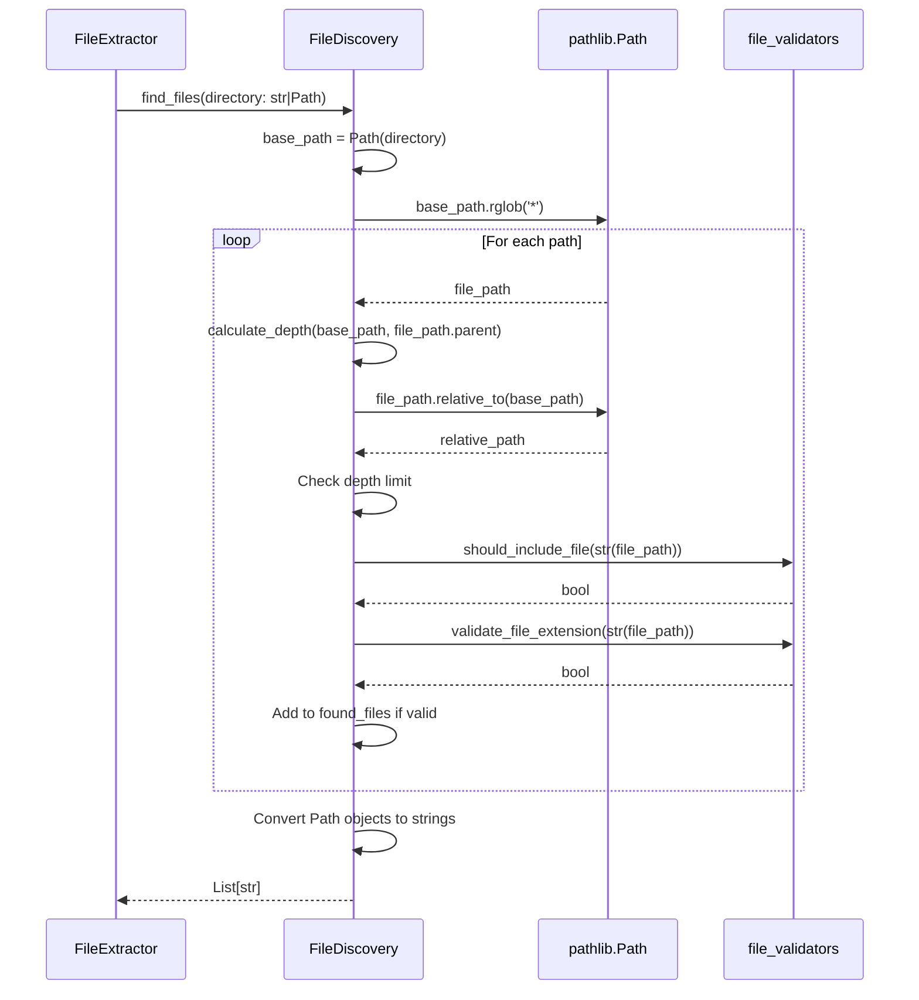

I have created the following plan after thorough exploration and analysis of the codebase. Follow the below plan verbatim. Trust the files and references. Do not re-verify what's written in the plan. Explore only when absolutely necessary. First implement all the proposed file changes and then I'll review all the changes together at the end.

## Beobachtungen

Das Modul `file_discovery.py` nutzt aktuell `os.walk()`, `os.path.join()`, `os.path.exists()`, `os.path.abspath()`, `os.path.relpath()`, `os.sep`, `os.path.basename()` und `os.path.getsize()`. Die Tests verwenden bereits `tempfile.TemporaryDirectory()` für Fixtures, sollten aber auf Pytest's native `tmp_path` migriert werden. Die Kompatibilitätstests (Zeilen 282-324) referenzieren nicht-existierende Funktionen aus `folder_extractor.main` und müssen entfernt oder aktualisiert werden. Das Interface `IFileDiscovery` definiert String-Parameter, daher muss die Backward-Kompatibilität durch String-zu-Path-Konvertierung gewährleistet werden.

## Ansatz

Striktes TDD: Zuerst Tests aktualisieren (Red), dann Produktivcode refactoren (Green), dann Coverage verifizieren. Die öffentlichen Schnittstellen behalten `str` als Eingabetyp für Backward-Kompatibilität, konvertieren aber intern sofort zu `Path`-Objekten. `os.walk()` wird durch `Path.rglob()` oder manuelle Iteration mit `Path.iterdir()` ersetzt. Alle `os.path.*` Operationen werden durch entsprechende `pathlib.Path` Methoden ersetzt. Tests werden auf `tmp_path` Fixture migriert und Kompatibilitätstests entfernt.

## Implementierungsschritte

### Schritt 1: Test-Vorbereitung (TDD Red Phase)

**Datei:** `file:tests/unit/test_core_file_discovery.py`

1. **Kompatibilitätstests entfernen**: Lösche die Klasse `TestCompatibility` (Zeilen 282-324), da die referenzierten Funktionen `finde_dateien` und `pruefe_weblink_domain` nicht mehr existieren

2. **Auf `tmp_path` Fixture migrieren**: Ersetze alle `tempfile.TemporaryDirectory()` Context Manager durch Pytest's native `tmp_path` Fixture:
   - Ändere Methodensignaturen: `def test_method(self, tmp_path):`
   - Ersetze `with tempfile.TemporaryDirectory() as temp_dir:` durch direkte Nutzung von `tmp_path`
   - Entferne `import tempfile`

3. **String/Path Kompatibilitätstests hinzufügen**: Füge neue Testmethoden hinzu, die verifizieren, dass sowohl Strings als auch Path-Objekte akzeptiert werden:
   ```python
   def test_find_files_accepts_string_path(self, tmp_path):
       """Verify backward compatibility with string paths."""
       
   def test_find_files_accepts_path_object(self, tmp_path):
       """Verify Path objects are accepted."""
   ```

4. **Tests ausführen**: Führe `pytest tests/unit/test_core_file_discovery.py -v` aus - Tests sollten noch grün sein (außer neue Tests, die Red sind)

### Schritt 2: Produktivcode Refactoring - `find_files()` Methode

**Datei:** `file:folder_extractor/core/file_discovery.py`

1. **Import aktualisieren**: Stelle sicher, dass `Union` von `typing` importiert ist

2. **Type Hints aktualisieren**: Ändere Signatur von `find_files()`:
   ```python
   def find_files(self, directory: Union[str, Path], max_depth: int = 0,
                  file_type_filter: Optional[List[str]] = None,
                  include_hidden: bool = False) -> List[str]:
   ```

3. **String-zu-Path-Konvertierung**: Füge am Anfang der Methode hinzu:
   ```python
   base_path = Path(directory)
   ```

4. **`os.walk()` durch Path-Iteration ersetzen**: Ersetze die `os.walk()` Schleife durch eine rekursive Iteration mit `Path.rglob()` oder manuelle Iteration:
   - Nutze `base_path.rglob('*')` für unbegrenzte Tiefe
   - Implementiere Tiefenprüfung durch Vergleich von `len(path.relative_to(base_path).parts)`
   - Filtere Verzeichnisse mit `path.is_file()` Check

5. **`os.path.join()` eliminieren**: Nutze `/` Operator für Pfadkonstruktion oder direkte Path-Objekte

6. **Versteckte Verzeichnisse filtern**: Ersetze `dirs[:] = [d for d in dirs if not d.startswith(HIDDEN_FILE_PREFIX)]` durch Filterung in der Iteration mit `path.name.startswith(HIDDEN_FILE_PREFIX)`

7. **Rückgabewert**: Konvertiere Path-Objekte zurück zu Strings für Backward-Kompatibilität: `return [str(p) for p in found_files]`

### Schritt 3: Produktivcode Refactoring - `_calculate_depth()` Methode

**Datei:** `file:folder_extractor/core/file_discovery.py`

1. **Type Hints aktualisieren**: Ändere Signatur:
   ```python
   def _calculate_depth(self, base_dir: Union[str, Path], current_dir: Union[str, Path]) -> int:
   ```

2. **Path-Konvertierung**: Ersetze `os.path.abspath()` durch `Path.resolve()`:
   ```python
   base_path = Path(base_dir).resolve()
   current_path = Path(current_dir).resolve()
   ```

3. **Relative Pfadberechnung**: Ersetze `os.path.relpath()` und `os.sep` durch `Path.relative_to()` und `len(path.parts)`:
   ```python
   try:
       rel_path = current_path.relative_to(base_path)
       if rel_path == Path('.'):
           return 0
       return len(rel_path.parts)
   except ValueError:
       return 0
   ```

### Schritt 4: Produktivcode Refactoring - `check_weblink_domain()` Methode

**Datei:** `file:folder_extractor/core/file_discovery.py`

1. **Type Hints aktualisieren**: Ändere Signatur:
   ```python
   def check_weblink_domain(self, filepath: Union[str, Path], allowed_domains: List[str]) -> bool:
   ```

2. **Path-Konvertierung und Existenzprüfung**: Ersetze `os.path.exists()`:
   ```python
   file_path = Path(filepath)
   if not file_path.exists():
       return False
   ```

3. **Suffix-Prüfung**: Ersetze `filepath.endswith()` durch `file_path.suffix`:
   ```python
   if file_path.suffix == '.url':
       return self._check_url_file(str(file_path), allowed_domains)
   elif file_path.suffix == '.webloc':
       return self._check_webloc_file(str(file_path), allowed_domains)
   ```

### Schritt 5: Produktivcode Refactoring - `FileFilter` Klasse

**Datei:** `file:folder_extractor/core/file_discovery.py`

1. **`add_size_filter()` Methode**: Ersetze `os.path.getsize()` durch `Path.stat().st_size`:
   ```python
   def filter_func(filepath: str) -> bool:
       try:
           size = Path(filepath).stat().st_size
           # ... rest of logic
   ```

2. **`add_name_pattern_filter()` Methode**: Ersetze `os.path.basename()` durch `Path.name`:
   ```python
   def filter_func(filepath: str) -> bool:
       filename = Path(filepath).name
       return fnmatch.fnmatch(filename, pattern)
   ```

### Schritt 6: Interface-Update

**Datei:** `file:folder_extractor/core/file_discovery.py`

1. **`IFileDiscovery` Interface**: Aktualisiere Type Hints im Abstract Interface:
   ```python
   @abstractmethod
   def find_files(self, directory: Union[str, Path], max_depth: int = 0,
                  file_type_filter: Optional[List[str]] = None,
                  include_hidden: bool = False) -> List[str]:
   ```

2. **`check_weblink_domain()` Interface**: Aktualisiere Type Hints:
   ```python
   @abstractmethod
   def check_weblink_domain(self, filepath: Union[str, Path], allowed_domains: List[str]) -> bool:
   ```

### Schritt 7: Import-Bereinigung

**Datei:** `file:folder_extractor/core/file_discovery.py`

1. **Entferne `os` Import**: Lösche `import os` (Zeile 6)
2. **Füge `Union` hinzu**: Stelle sicher, dass `from typing import Union` vorhanden ist
3. **Behalte `Path` Import**: `from pathlib import Path` bleibt bestehen

### Schritt 8: Tests finalisieren und Coverage prüfen

**Datei:** `file:tests/unit/test_core_file_discovery.py`

1. **Alle Tests ausführen**: `pytest tests/unit/test_core_file_discovery.py -v`
2. **Coverage prüfen**: `pytest tests/unit/test_core_file_discovery.py --cov=folder_extractor.core.file_discovery --cov-report=term-missing --cov-fail-under=100`
3. **Bei Coverage < 100%**: Identifiziere fehlende Testfälle und ergänze sie
4. **Backward-Kompatibilität verifizieren**: Stelle sicher, dass Tests mit String-Pfaden erfolgreich durchlaufen

### Schritt 9: Integration mit abhängigen Modulen testen

1. **Extractor-Tests ausführen**: `pytest tests/unit/test_core_extractor.py -v` - sollten weiterhin grün sein
2. **Gesamte Test-Suite**: `pytest tests/unit/ -v` - alle Unit-Tests sollten grün sein
3. **Coverage für gesamtes Core-Modul**: `pytest --cov=folder_extractor.core --cov-report=term-missing`

## Architektur-Diagramm



## Wichtige Hinweise

| Aspekt | Details |
|--------|---------|
| **Backward-Kompatibilität** | Öffentliche Schnittstellen akzeptieren `Union[str, Path]`, geben aber Strings zurück |
| **Interne Konvertierung** | Strings werden sofort am Methodeneingang zu Path-Objekten konvertiert |
| **os.walk() Ersatz** | Nutze `Path.rglob()` für rekursive Iteration oder manuelle Iteration mit `Path.iterdir()` |
| **Tiefenberechnung** | `Path.relative_to()` und `len(path.parts)` statt `os.path.relpath()` und `os.sep` |
| **Versteckte Dateien** | Filtere mit `path.name.startswith('.')` statt String-Operationen |
| **Kompatibilitätstests** | Entferne Tests für nicht-existierende Funktionen aus `folder_extractor.main` |
| **tmp_path Fixture** | Migriere von `tempfile.TemporaryDirectory()` zu Pytest's `tmp_path` |
| **Coverage-Ziel** | 100% - keine Ausnahmen |