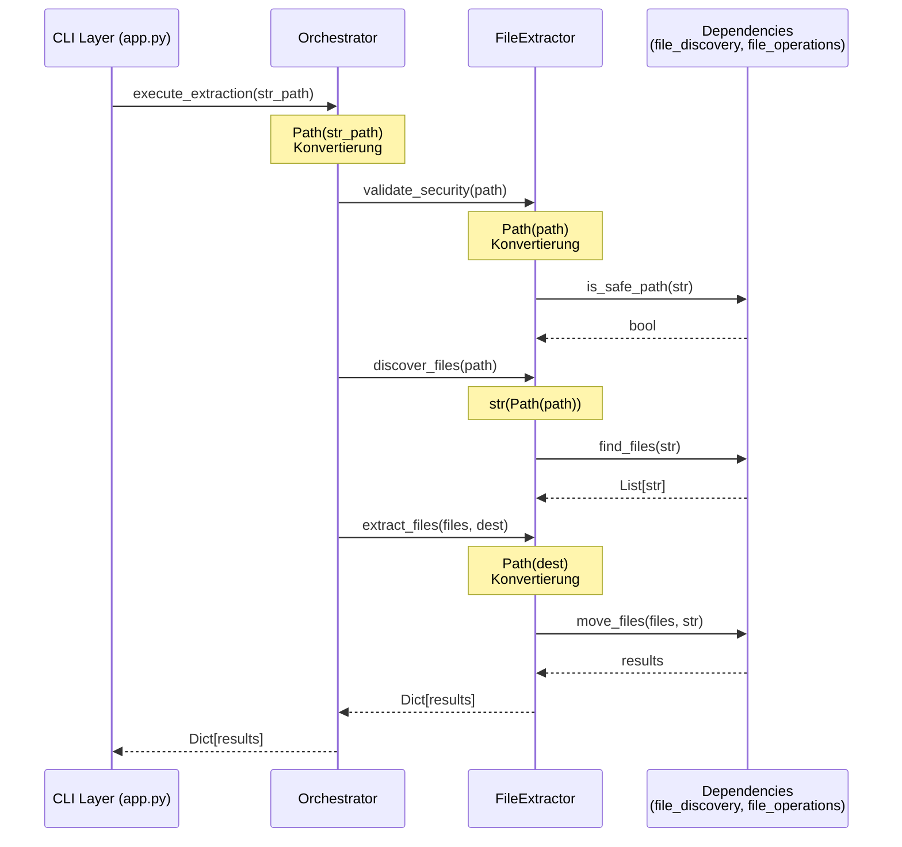

I have created the following plan after thorough exploration and analysis of the codebase. Follow the below plan verbatim. Trust the files and references. Do not re-verify what's written in the plan. Explore only when absolutely necessary. First implement all the proposed file changes and then I'll review all the changes together at the end.

## Beobachtungen zur Codebase

Die Extractor-Module (`extractor.py` und `extractor_v2.py`) verwenden aktuell `os.path.*` und `os.*` Methoden für Pfadoperationen. Die Hauptproblembereiche sind:
- `extractor.py`: `os.path.dirname()`, `os.makedirs()`, `os.path.exists()` in der `undo_last_operation` Methode
- `extractor_v2.py`: `os.walk()`, `os.rmdir()` in der `_remove_empty_directories` Methode
- Die CLI-Schicht (`app.py`) liefert Strings via `os.getcwd()`, die als Boundary für die String-zu-Path-Konvertierung dient
- Tests verwenden bereits teilweise `Path`-Objekte, müssen aber konsistent auf pathlib umgestellt werden

## Gewählter Ansatz

Der Refactoring-Ansatz folgt dem TDD-Prinzip strikt: Zuerst Tests anpassen (Red), dann Implementierung (Green), dann Coverage prüfen. Die String-zu-Path-Konvertierung erfolgt an der Orchestrator-Ebene, wo CLI-Strings empfangen werden. Die öffentlichen APIs akzeptieren `Union[str, Path]` für Abwärtskompatibilität, konvertieren aber intern sofort zu `Path`-Objekten. Die `undo_last_operation` Methode wird vollständig auf pathlib umgestellt, ebenso die `_remove_empty_directories` Methode in `extractor_v2.py`.

---

## Implementierungsschritte

### 1. Test-Vorbereitung: `test_core_extractor.py` auf pathlib umstellen

**Ziel**: Tests so anpassen, dass sie Path-Objekte verwenden und pathlib-basierte Mocks erstellen.

#### 1.1 Import-Anpassungen
- Füge `from pathlib import Path` hinzu (bereits vorhanden, Zeile 6)
- Stelle sicher, dass alle Test-Fixtures `Path`-Objekte verwenden

#### 1.2 Test-Fixtures mit `tmp_path` refactoren
- Ersetze `tempfile.TemporaryDirectory()` durch pytest's native `tmp_path` Fixture
- Beispiel: `test_discover_files_basic`, `test_extract_files_normal_mode`, etc.
- Ändere von:
  ```python
  with tempfile.TemporaryDirectory() as temp_dir:
      subdir = Path(temp_dir) / "subdir"
  ```
- Zu:
  ```python
  def test_discover_files_basic(self, tmp_path):
      subdir = tmp_path / "subdir"
  ```

#### 1.3 Path-Objekte in Assertions verwenden
- Ändere String-basierte Pfad-Assertions zu Path-basierten
- Beispiel in `test_undo_last_operation`:
  ```python
  assert (Path(temp_dir) / "original" / "file.txt").exists()
  ```

#### 1.4 Mock-Anpassungen für pathlib
- Keine `os.path` Mocks mehr nötig, da echte `tmp_path` Fixtures verwendet werden
- Falls Mocks nötig: Mocke `Path.exists()`, `Path.mkdir()`, etc. statt `os.path.*`

**Betroffene Tests**:
- `test_validate_security_safe_path` (Zeile 31-43)
- `test_discover_files_basic` (Zeile 53-73)
- `test_extract_files_normal_mode` (Zeile 100-119)
- `test_extract_files_sort_by_type` (Zeile 121-141)
- `test_extract_files_dry_run` (Zeile 143-158)
- `test_undo_last_operation` (Zeile 160-185)
- `test_undo_no_history` (Zeile 187-191)
- `test_full_extraction_workflow` (Zeile 283-329)
- `test_extraction_with_abort` (Zeile 331-355)

---

### 2. `extractor.py` - Type Hints und Imports anpassen

**Ziel**: Vorbereitung für pathlib durch Type Hints und Imports.

#### 2.1 Imports erweitern
```python
from pathlib import Path
from typing import List, Tuple, Optional, Dict, Any, Callable, Union
```

#### 2.2 Type Hints in Interface `IExtractor` anpassen
- `validate_security(self, path: Union[str, Path]) -> None`
- `discover_files(self, path: Union[str, Path]) -> List[str]`
- `extract_files(self, files: List[str], destination: Union[str, Path], ...) -> Dict[str, Any]`
- `undo_last_operation(self, path: Union[str, Path]) -> int`

#### 2.3 Type Hints in `FileExtractor` anpassen
- Gleiche Signaturen wie im Interface
- Interne Hilfsmethoden können `Path` direkt verwenden

---

### 3. `extractor.py` - `undo_last_operation` auf pathlib refactoren

**Ziel**: Vollständige Umstellung der Undo-Funktionalität auf pathlib.

#### 3.1 String-zu-Path-Konvertierung am Methodeneingang
```python
def undo_last_operation(self, path: Union[str, Path]) -> int:
    path = Path(path)  # Konvertierung am Eingang
```

#### 3.2 `os.path.dirname()` durch `Path.parent` ersetzen
- Zeile 224: `os.path.dirname(operation["original_pfad"])` → `Path(operation["original_pfad"]).parent`

#### 3.3 `os.makedirs()` durch `Path.mkdir()` ersetzen
- Zeile 224-227: 
  ```python
  os.makedirs(os.path.dirname(operation["original_pfad"]), exist_ok=True)
  ```
  → 
  ```python
  Path(operation["original_pfad"]).parent.mkdir(parents=True, exist_ok=True)
  ```

#### 3.4 `os.path.exists()` durch `Path.exists()` ersetzen
- Zeile 222: `os.path.exists(operation["neuer_pfad"])` → `Path(operation["neuer_pfad"]).exists()`

**Betroffene Zeilen**: 197-243

---

### 4. `extractor.py` - Weitere Methoden anpassen

**Ziel**: Konsistente pathlib-Nutzung in allen Methoden.

#### 4.1 `validate_security` - Path-Konvertierung
```python
def validate_security(self, path: Union[str, Path]) -> None:
    path_str = str(Path(path))  # is_safe_path erwartet String (bis Phase 1 abgeschlossen)
    if not is_safe_path(path_str):
        raise SecurityError(MESSAGES["SECURITY_ERROR"].format(path=path_str))
```

#### 4.2 `discover_files` - Path-Konvertierung
```python
def discover_files(self, path: Union[str, Path]) -> List[str]:
    path_str = str(Path(path))
    return self.file_discovery.find_files(
        directory=path_str,
        ...
    )
```

#### 4.3 `extract_files` - Path-Konvertierung
```python
def extract_files(self, files: List[str], destination: Union[str, Path], ...) -> Dict[str, Any]:
    destination = Path(destination)
    destination_str = str(destination)
    # Verwende destination_str für Aufrufe an file_mover
```

---

### 5. `ExtractionOrchestrator` - String-zu-Path-Konvertierung

**Ziel**: Orchestrator als Boundary für String-zu-Path-Konvertierung etablieren.

#### 5.1 `execute_extraction` - Path-Konvertierung am Eingang
```python
def execute_extraction(self, 
                      source_path: Union[str, Path],
                      ...) -> Dict[str, Any]:
    source_path = Path(source_path)
    # Konvertiere zu String für Extractor-Aufrufe (bis Dependencies refactored)
    source_path_str = str(source_path)
    
    self.extractor.validate_security(source_path_str)
    files = self.extractor.discover_files(source_path_str)
    ...
```

#### 5.2 `execute_undo` - Path-Konvertierung
```python
def execute_undo(self, path: Union[str, Path]) -> Dict[str, Any]:
    path = Path(path)
    path_str = str(path)
    
    self.extractor.validate_security(path_str)
    restored = self.extractor.undo_last_operation(path_str)
    ...
```

**Betroffene Zeilen**: 246-333

---

### 6. `extractor_v2.py` - Type Hints und Imports anpassen

**Ziel**: Vorbereitung für pathlib in Enhanced Extractor.

#### 6.1 Imports erweitern
```python
from pathlib import Path
from typing import List, Optional, Dict, Any, Callable, Union
```

#### 6.2 Type Hints in Interface `IEnhancedExtractor` anpassen
- `validate_security(self, path: Union[str, Path]) -> None`
- `discover_files(self, path: Union[str, Path]) -> List[str]`
- `extract_files(self, files: List[str], destination: Union[str, Path], ...) -> Dict[str, Any]`
- `undo_last_operation(self, path: Union[str, Path]) -> Dict[str, Any]`

---

### 7. `extractor_v2.py` - `_remove_empty_directories` auf pathlib refactoren

**Ziel**: Vollständige Umstellung der Directory-Cleanup-Funktionalität auf pathlib.

#### 7.1 String-zu-Path-Konvertierung
```python
def _remove_empty_directories(self, path: Union[str, Path], temp_files: list) -> int:
    path = Path(path)
```

#### 7.2 `os.walk()` durch `Path.rglob()` oder iterative Lösung ersetzen
- Zeile 221: `for root, dirs, files in os.walk(path, topdown=False):`
- Ersetze durch:
  ```python
  # Sammle alle Verzeichnisse
  directories = sorted([d for d in path.rglob('*') if d.is_dir()], 
                       key=lambda x: len(x.parts), reverse=True)
  
  for directory in directories:
      if directory == path:
          continue
      
      # Prüfe ob Verzeichnis leer ist
      dir_content = list(directory.iterdir())
      ...
  ```

#### 7.3 `os.rmdir()` durch `Path.rmdir()` ersetzen
- Zeile 238: `os.rmdir(root)` → `directory.rmdir()`

#### 7.4 Hidden Files Handling mit pathlib
- Zeile 228-233: Verwende `Path.name.startswith('.')` statt String-Checks
- Zeile 159-164: Verwende `item_path.unlink()` für Dateien, `shutil.rmtree(item_path)` für Verzeichnisse

**Betroffene Zeilen**: 209-243

---

### 8. `extractor_v2.py` - Weitere Methoden anpassen

**Ziel**: Konsistente pathlib-Nutzung in allen Enhanced Extractor Methoden.

#### 8.1 `validate_security` - Path-Konvertierung
```python
def validate_security(self, path: Union[str, Path]) -> None:
    path_str = str(Path(path))
    if not is_safe_path(path_str):
        raise SecurityError(MESSAGES["SECURITY_ERROR"].format(path=path_str))
```

#### 8.2 `discover_files` - Path-Konvertierung
```python
def discover_files(self, path: Union[str, Path]) -> List[str]:
    path_str = str(Path(path))
    return self.file_discovery.find_files(
        directory=path_str,
        ...
    )
```

#### 8.3 `extract_files` - Path-Konvertierung
```python
def extract_files(self, files: List[str], destination: Union[str, Path], ...) -> Dict[str, Any]:
    destination = Path(destination)
    destination_str = str(destination)
    # Verwende destination_str für file_mover Aufrufe
```

#### 8.4 `undo_last_operation` - Path-Konvertierung
```python
def undo_last_operation(self, path: Union[str, Path]) -> Dict[str, Any]:
    path = Path(path)
    path_str = str(path)
    history_data = self.history_manager.load_history(path_str)
    ...
```

---

### 9. `EnhancedExtractionOrchestrator` - String-zu-Path-Konvertierung

**Ziel**: Orchestrator als Boundary etablieren.

#### 9.1 `execute_extraction` - Path-Konvertierung
```python
def execute_extraction(self, source_path: Union[str, Path], ...) -> Dict[str, Any]:
    source_path = Path(source_path)
    source_path_str = str(source_path)
    
    self.extractor.validate_security(source_path_str)
    files = self.extractor.discover_files(source_path_str)
    ...
```

#### 9.2 `execute_undo` - Path-Konvertierung
```python
def execute_undo(self, path: Union[str, Path]) -> Dict[str, Any]:
    path = Path(path)
    return self.extractor.undo_last_operation(path)
```

**Betroffene Zeilen**: 319-415

---

### 10. Tests aktualisieren und Coverage prüfen

**Ziel**: Sicherstellen, dass alle Tests grün sind und 100% Coverage erreicht wird.

#### 10.1 Alle Tests ausführen
```bash
pytest tests/unit/test_core_extractor.py -v
```

#### 10.2 Coverage für extractor Module prüfen
```bash
pytest --cov=folder_extractor.core.extractor --cov=folder_extractor.core.extractor_v2 --cov-report=term-missing --cov-fail-under=100
```

#### 10.3 Fehlende Coverage identifizieren
- Prüfe `--cov-report=term-missing` Output
- Füge Tests für nicht abgedeckte Zeilen hinzu

#### 10.4 Edge Cases testen
- Path-Objekte als Input
- String-Pfade als Input
- Gemischte Verwendung
- Fehlerbehandlung bei ungültigen Pfaden

---

### 11. Integration mit CLI-Layer vorbereiten

**Ziel**: Sicherstellen, dass die CLI-Integration funktioniert (wird in Phase 6 vollständig umgesetzt).

#### 11.1 Dokumentiere String-zu-Path-Konvertierung
- Kommentiere in `app.py`, dass `os.getcwd()` in Phase 6 durch `Path.cwd()` ersetzt wird
- Stelle sicher, dass Orchestrator-Aufrufe mit Strings funktionieren

#### 11.2 Backward Compatibility testen
- Teste, dass String-Pfade weiterhin akzeptiert werden
- Teste, dass Path-Objekte ebenfalls funktionieren

---

## Architektur-Übersicht



---

## Datei-Übersicht

| Datei | Änderungen | Priorität |
|-------|-----------|-----------|
| `file:tests/unit/test_core_extractor.py` | Tests auf `tmp_path` und Path-Objekte umstellen | Hoch |
| `file:folder_extractor/core/extractor.py` | Type Hints, `undo_last_operation` refactoren | Hoch |
| `file:folder_extractor/core/extractor_v2.py` | Type Hints, `_remove_empty_directories` refactoren | Hoch |

---

## Verifikation

Nach jedem Schritt:
1. **Tests ausführen**: `pytest tests/unit/test_core_extractor.py -v`
2. **Coverage prüfen**: `pytest --cov=folder_extractor.core.extractor --cov=folder_extractor.core.extractor_v2 --cov-report=term-missing --cov-fail-under=100`
3. **Keine Warnings**: Stelle sicher, dass keine `DeprecationWarnings` bezüglich `os.path` existieren

**Definition of Done**:
- ✅ Alle Tests in `test_core_extractor.py` sind grün
- ✅ 100% Coverage für `extractor.py` und `extractor_v2.py`
- ✅ Keine `os.path.*` oder `os.makedirs()`, `os.walk()`, `os.rmdir()` in Extractor-Dateien
- ✅ Type Hints verwenden `Union[str, Path]` an öffentlichen Schnittstellen
- ✅ String-zu-Path-Konvertierung erfolgt am Orchestrator-Level
- ✅ Backward Compatibility: String-Pfade werden weiterhin akzeptiert