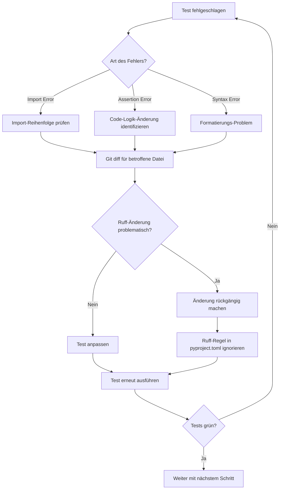

I have created the following plan after thorough exploration and analysis of the codebase. Follow the below plan verbatim. Trust the files and references. Do not re-verify what's written in the plan. Explore only when absolutely necessary. First implement all the proposed file changes and then I'll review all the changes together at the end.

## Beobachtungen zur Codebasis

Die Codebasis ist bereits gut strukturiert und verwendet moderne Python-Patterns (Pathlib, Type Hints, ABC-Interfaces). Der Code folgt weitgehend PEP 8-Standards. Die Imports sind größtenteils organisiert, aber nicht strikt nach isort-Konventionen sortiert. Es gibt keine offensichtlichen Code-Smell-Probleme. Die Test-Suite ist umfassend mit Unit-, Integration- und Performance-Tests. Das Projekt verwendet bereits `pytest` und `pytest-cov` für Testing.

## Ansatz

Der Ansatz ist iterativ und sicherheitsorientiert: Zuerst wird Ruff im Check-Modus ausgeführt, um potenzielle Änderungen zu identifizieren. Dann werden automatische Fixes angewendet und sorgfältig überprüft. Anschließend erfolgt die Formatierung. Nach jedem Schritt werden die Tests ausgeführt, um sicherzustellen, dass keine Breaking Changes entstanden sind. Besonderes Augenmerk liegt auf Import-Reordering und Code-Simplifications, die die Logik beeinflussen könnten.

## Implementierungsschritte

### 1. Vorbereitung: Ruff-Installation verifizieren

Stelle sicher, dass Ruff installiert ist und die Konfiguration aus Phase 1 vorhanden ist:

```bash
pip install ruff>=0.3.0
ruff --version
```

Verifiziere, dass `file:pyproject.toml` die `[tool.ruff]`, `[tool.ruff.lint]` und `[tool.ruff.format]` Sektionen enthält.

### 2. Dry-Run: Ruff Check ohne Fixes

Führe zunächst einen Dry-Run aus, um zu sehen, welche Änderungen Ruff vornehmen würde:

```bash
ruff check . --output-format=grouped
```

Analysiere die Ausgabe und kategorisiere die Violations:
- **Import-Sortierung (I001, I002)**: Harmlos, verbessert nur die Organisation
- **Unused Imports (F401)**: Sollten entfernt werden
- **Line too long (E501)**: Werden durch `ruff format` behoben
- **Simplifications (SIM)**: Müssen manuell geprüft werden, ob sie die Logik ändern
- **Bugbear (B)**: Potenzielle Bugs, sollten behoben werden

Erstelle eine Liste der betroffenen Dateien und der Art der Violations.

### 3. Automatische Fixes anwenden

Führe Ruff mit `--fix` aus, um automatisch behebbare Violations zu korrigieren:

```bash
ruff check . --fix
```

**Wichtige Bereiche zur Überprüfung nach dem Fix:**

| Bereich | Dateien | Zu prüfen |
|---------|---------|-----------|
| Import-Reordering | Alle `.py` Dateien | Keine zirkulären Imports, korrekte Initialisierungsreihenfolge |
| Core-Logik | `file:folder_extractor/core/extractor.py`, `file:folder_extractor/core/file_operations.py`, `file:folder_extractor/core/file_discovery.py` | Keine Änderungen an Kontrollfluss, Error-Handling, oder Algorithmen |
| CLI-Interface | `file:folder_extractor/cli/app.py`, `file:folder_extractor/cli/parser.py` | Argument-Parsing und User-Interaktion unverändert |
| Tests | `file:tests/` (alle Dateien) | Test-Logik und Assertions unverändert |

### 4. Git Diff Review

Überprüfe alle Änderungen mit Git:

```bash
git diff
```

**Review-Checkliste:**

- [ ] **Imports**: Sind nur umgeordnet, nicht entfernt oder hinzugefügt?
- [ ] **Whitespace**: Nur kosmetische Änderungen?
- [ ] **String Formatting**: Keine Änderungen an String-Inhalten?
- [ ] **Comprehensions**: Vereinfachungen ändern nicht die Logik?
- [ ] **If/Else**: Vereinfachungen sind semantisch äquivalent?
- [ ] **Exception Handling**: Try/Except-Blöcke unverändert?

**Kritische Patterns, die manuell geprüft werden müssen:**

```python
# SIM108: Ternary statt if/else
# Vorher:
if condition:
    x = a
else:
    x = b
# Nachher:
x = a if condition else b

# SIM105: Suppressible exception
# Vorher:
try:
    do_something()
except Exception:
    pass
# Nachher:
with contextlib.suppress(Exception):
    do_something()
```

Falls solche Änderungen vorgenommen wurden, verifiziere, dass sie die Semantik nicht ändern.

### 5. Code-Formatierung anwenden

Führe Ruff Format aus, um den Code einheitlich zu formatieren:

```bash
ruff format .
```

Dies wird:
- Zeilen auf 88 Zeichen umbrechen
- Konsistente Anführungszeichen verwenden (double quotes)
- Trailing Commas hinzufügen
- Whitespace normalisieren

**Erwartete Änderungen:**
- Lange Zeilen werden umgebrochen (besonders in `file:folder_extractor/core/extractor.py` und `file:folder_extractor/core/file_operations.py`)
- Konsistente Formatierung von Docstrings
- Einheitliche Einrückung in Multi-Line-Statements

### 6. Erneuter Git Diff Review

Überprüfe die Formatierungsänderungen:

```bash
git diff
```

Stelle sicher, dass nur Whitespace und Formatierung geändert wurden, keine Logik.

### 7. Tests ausführen - Vollständige Suite

Führe die komplette Test-Suite aus:

```bash
python run_tests.py all
```

**Erwartetes Ergebnis:** Alle Tests sollten grün sein.

**Falls Tests fehlschlagen:**



### 8. Spezifische Test-Kategorien

Führe Tests in Kategorien aus, um Problembereiche zu isolieren:

```bash
# Unit Tests
python run_tests.py unit

# Integration Tests
python run_tests.py integration

# Performance Tests (sollten keine Regression zeigen)
python run_tests.py performance
```

### 9. Coverage-Verifikation

Stelle sicher, dass die Code-Coverage nicht gesunken ist:

```bash
python run_tests.py coverage
```

Vergleiche die Coverage-Zahlen mit dem vorherigen Stand. Ruff sollte die Coverage nicht beeinflussen.

### 10. Manuelle Funktionsprüfung

Führe manuelle Tests durch, um sicherzustellen, dass die CLI funktioniert:

```bash
# Test 1: Hilfe anzeigen
python -m folder_extractor --help

# Test 2: Dry-Run in sicherem Verzeichnis
cd ~/Desktop
mkdir ruff_test_folder
cd ruff_test_folder
mkdir subdir
touch subdir/test1.txt subdir/test2.pdf
python -m folder_extractor --dry-run

# Test 3: Echte Extraktion
python -m folder_extractor

# Test 4: Undo
python -m folder_extractor --undo

# Cleanup
cd ..
rm -rf ruff_test_folder
```

### 11. Ruff-Compliance verifizieren

Stelle sicher, dass keine Violations mehr existieren:

```bash
# Check für Linting-Violations
ruff check .

# Check für Formatierungs-Violations
ruff format --check .
```

**Erwartete Ausgabe:** Keine Violations, beide Befehle sollten erfolgreich sein.

### 12. Dokumentation der Änderungen

Erstelle eine Zusammenfassung der vorgenommenen Änderungen:

**Änderungs-Template:**

```markdown
## Ruff Linting & Formatting - Änderungszusammenfassung

### Automatische Fixes
- Import-Sortierung in X Dateien
- Entfernte unused imports: [Liste]
- Vereinfachte Code-Patterns: [Liste mit Datei:Zeile]

### Formatierung
- Umgebrochene lange Zeilen: X Stellen
- Normalisierte Anführungszeichen: X Stellen
- Trailing Commas hinzugefügt: X Stellen

### Test-Ergebnisse
- Unit Tests: ✅ Alle bestanden
- Integration Tests: ✅ Alle bestanden
- Performance Tests: ✅ Keine Regression
- Coverage: X% (unverändert)

### Manuelle Anpassungen
[Falls erforderlich: Liste der manuellen Änderungen]

### Ignorierte Regeln
[Falls erforderlich: Liste der in pyproject.toml ignorierten Regeln mit Begründung]
```

## Erwartetes Ergebnis

Nach Abschluss dieser Phase:

- ✅ Alle Python-Dateien sind mit Ruff gelintet und formatiert
- ✅ Imports sind nach isort-Standard sortiert
- ✅ Code folgt strikten Qualitätsstandards (E, F, I, B, UP, SIM)
- ✅ Einheitliche Formatierung mit 88 Zeichen Line Length
- ✅ Alle Tests sind grün (100% Pass-Rate)
- ✅ Keine Ruff-Violations mehr vorhanden
- ✅ Code-Coverage unverändert
- ✅ CLI-Funktionalität vollständig erhalten

**Dateien mit erwarteten Änderungen:**

| Kategorie | Anzahl Dateien | Hauptänderungen |
|-----------|----------------|-----------------|
| Core-Module | ~10 | Import-Sortierung, Formatierung |
| CLI-Module | ~4 | Import-Sortierung, Formatierung |
| Utils-Module | ~4 | Import-Sortierung, Formatierung |
| Config-Module | ~3 | Import-Sortierung, Formatierung |
| Unit Tests | ~15 | Import-Sortierung, Formatierung |
| Integration Tests | ~2 | Import-Sortierung, Formatierung |
| Performance Tests | ~1 | Import-Sortierung, Formatierung |

**Geschätzte Änderungen:** 200-400 Zeilen (hauptsächlich Whitespace und Import-Reordering)