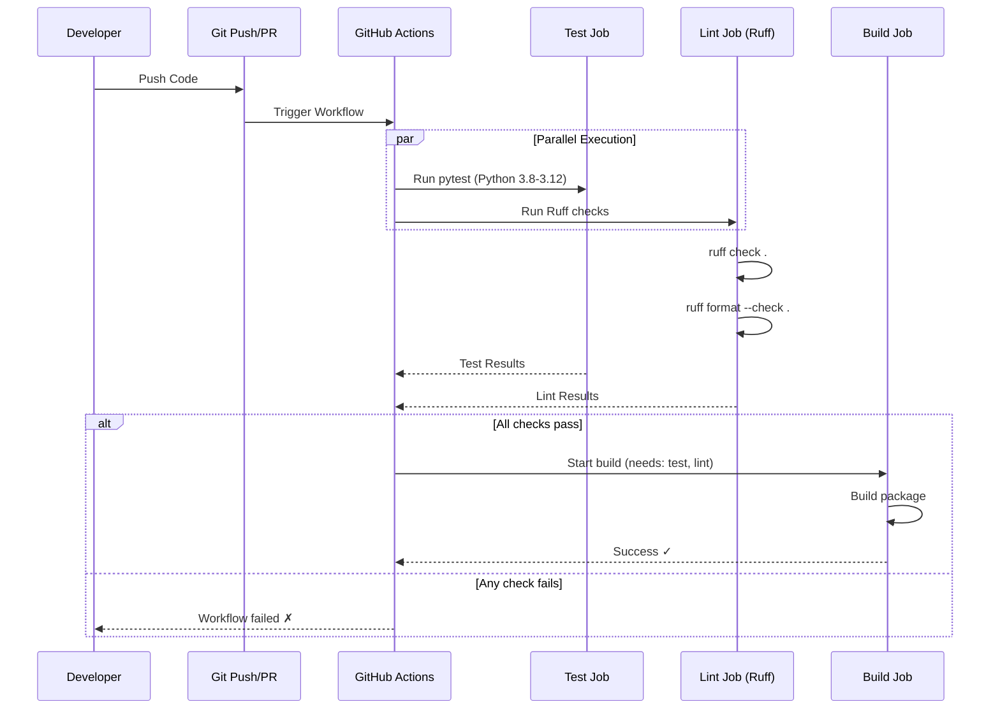

# CD-Workflow & Dokumentation für Ruff aktualisieren

Diese Dokumentation beschreibt die Aktualisierung der CI/CD-Pipeline und Entwicklerdokumentation zur Integration von Ruff.

## 🔍 Beobachtungen

Die Codebase ist bereits gut vorbereitet für die Ruff-Integration. In `file:.github/workflows/python-package.yml` (Zeilen 42-55) existiert ein vollständig konfigurierter, aber auskommentierter Lint-Job mit Ruff-Befehlen. Die Dokumentation in `file:CONTRIBUTING.md` referenziert noch die alten Tools Black, Flake8 und Isort (Zeilen 82-87, 103-105). Alle README-Dateien (`file:README_DE.md`, `file:README_V2.md`, `file:GITHUB_README.md`) enthalten Code-Style-Badges, die auf Black verweisen.

## 🎯 Ansatz

Die Migration zu Ruff erfolgt durch drei parallele Änderungen: (1) Aktivierung des vorbereiteten Lint-Jobs in der CI/CD-Pipeline, (2) Aktualisierung der Entwickler-Dokumentation mit Ruff-Befehlen, und (3) Anpassung aller Badge-Referenzen in den README-Dateien. Dieser Ansatz ist minimal-invasiv, da die Infrastruktur bereits vorhanden ist und nur aktiviert werden muss. Die Änderungen sind unabhängig voneinander und können parallel durchgeführt werden.

## 📋 Implementierungsschritte

### 1. CI/CD Workflow aktivieren

**Datei:** `file:.github/workflows/python-package.yml`

- **Zeilen 42-55 auskommentieren:** Entferne die Kommentarzeichen (`#`) vor allen Zeilen des `lint`-Jobs
- **TODO-Kommentar entfernen:** Lösche Zeile 42 (`# TODO: Replace with Ruff linting`)
- **Job-Abhängigkeit hinzufügen:** Aktualisiere Zeile 59 im `build`-Job von `needs: [test]` zu `needs: [test, lint]`, damit der Build erst nach erfolgreichem Linting startet

**Resultat:** Der Lint-Job wird bei jedem Push und Pull Request automatisch ausgeführt und prüft mit `ruff check .` und `ruff format --check .`

### 2. CONTRIBUTING.md aktualisieren

**Datei:** `file:CONTRIBUTING.md`

#### Abschnitt "Pull Request Process" (Zeilen 82-87)

Ersetze den gesamten Schritt 4 "Run linting" durch:

```markdown
4. **Run linting** to maintain code quality:
   ```bash
   ruff check .
   ruff format .
   ```
```

#### Abschnitt "Code Style" (Zeilen 98-106)

- **Zeile 103:** Ersetze "Use **Black** for code formatting (automatically enforced)" durch "Use **Ruff** for code formatting and linting (automatically enforced)"
- **Zeilen 104-105:** Entferne die Zeilen über isort und Flake8 komplett
- **Neue Zeile hinzufügen:** Nach der aktualisierten Zeile über Ruff füge hinzu: "Ruff combines formatting (Black-compatible) and linting (Flake8, isort, and more) in one tool"

### 3. README-Badges aktualisieren

Ersetze in allen drei README-Dateien den Code-Style-Badge:

**Dateien:** `file:README_DE.md` (Zeile 7), `file:README_V2.md` (Zeile 6), `file:GITHUB_README.md` (Zeile 5)

**Alt:**
```markdown
[](https://github.com/psf/black)
```

**Neu:**
```markdown
[](https://github.com/astral-sh/ruff)
```

**Hinweis:** Die Farbe `D7FF64` ist die offizielle Ruff-Brandfarbe (helles Gelb-Grün)

## 📊 Workflow-Visualisierung



## 📁 Betroffene Dateien

| Datei | Änderungstyp | Zeilen |
|-------|--------------|--------|
| `file:.github/workflows/python-package.yml` | Auskommentieren + Abhängigkeit | 42-55, 59 |
| `file:CONTRIBUTING.md` | Text ersetzen | 82-87, 103-105 |
| `file:README_DE.md` | Badge aktualisieren | 7 |
| `file:README_V2.md` | Badge aktualisieren | 6 |
| `file:GITHUB_README.md` | Badge aktualisieren | 5 |

## ✅ Verifikation

Nach der Implementierung:

1. **Lokale Prüfung:** Führe `ruff check .` und `ruff format --check .` aus, um sicherzustellen, dass keine Violations existieren
2. **CI-Test:** Pushe die Änderungen und beobachte den neuen Lint-Job in GitHub Actions
3. **Badge-Check:** Öffne die README-Dateien auf GitHub und verifiziere, dass die Ruff-Badges korrekt angezeigt werden
4. **Dokumentation:** Stelle sicher, dass `CONTRIBUTING.md` keine veralteten Tool-Referenzen mehr enthält