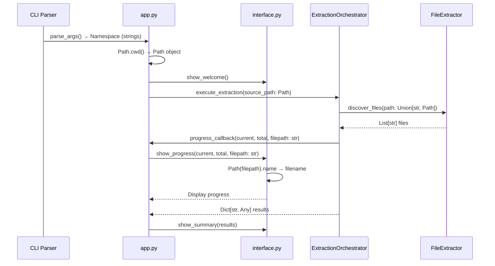

I have created the following plan after thorough exploration and analysis of the codebase. Follow the below plan verbatim. Trust the files and references. Do not re-verify what's written in the plan. Explore only when absolutely necessary. First implement all the proposed file changes and then I'll review all the changes together at the end.

## Beobachtungen

Die CLI-Module (`interface.py` und `app.py`) verwenden aktuell `os.getcwd()` und `os.path.basename()` für Pfadoperationen. Die CLI erhält String-Argumente vom Parser und übergibt diese an die Extractor-Orchestratoren. Nach Phase 5 sollten die Core-Module bereits `Union[str, Path]` akzeptieren. Die Tests verwenden Mock-Objekte und String-Pfade, müssen aber nicht zwingend auf Path-Objekte umgestellt werden, da die API beide Typen unterstützen soll.

## Ansatz

Der Refactoring-Ansatz folgt dem TDD-Prinzip: Zuerst werden die Tests angepasst, um Path-Objekte zu testen, dann wird der Produktivcode refactored. Die String-zu-Path-Konvertierung erfolgt so früh wie möglich in `app.py` (direkt nach `os.getcwd()`), während `interface.py` flexibel beide Typen akzeptiert. Die Backward-Kompatibilität bleibt erhalten, da die Core-Module `Union[str, Path]` akzeptieren.

## Implementierungsschritte

### 1. TDD-Schritt: Tests für `interface.py` vorbereiten

**Datei:** `file:tests/unit/test_cli_interface.py`

- Importiere `pathlib.Path` am Anfang der Datei
- In `test_show_progress()`: Teste mit sowohl String- als auch Path-Objekten
  - Füge Test-Case hinzu: `self.interface.show_progress(1, 10, Path("/path/to/file.txt"))`
  - Verifiziere, dass `"file.txt"` korrekt extrahiert wird
- In `test_show_progress_with_error()`: Teste mit Path-Objekt
  - Ändere Pfad zu `Path("/path/to/file.txt")`
- Führe Tests aus → sollten fehlschlagen (RED), da `interface.py` noch `os.path.basename()` verwendet

### 2. Refactor: `interface.py` auf pathlib umstellen

**Datei:** `file:folder_extractor/cli/interface.py`

- Füge Import hinzu: `from pathlib import Path`
- Entferne `import os` (Zeile 6)
- **Zeile 142** (`show_progress` Methode, Error-Fall):
  - Ersetze `os.path.basename(filepath)` durch:
    ```python
    Path(filepath).name
    ```
- **Zeile 149** (`show_progress` Methode, Progress-Bar):
  - Ersetze `os.path.basename(filepath)` durch:
    ```python
    filename = Path(filepath).name
    ```
- **Type Hints aktualisieren:**
  - Zeile 43-44: Ändere `filepath: str` zu `filepath: Union[str, Path]`
  - Zeile 117-118: Ändere `filepath: str` zu `filepath: Union[str, Path]`

### 3. Verify: Tests für `interface.py` ausführen

- Führe aus: `pytest tests/unit/test_cli_interface.py -v`
- Führe aus: `pytest --cov=folder_extractor.cli.interface --cov-fail-under=100`
- Alle Tests sollten grün sein (GREEN)

### 4. TDD-Schritt: Tests für `app.py` vorbereiten

**Datei:** `file:tests/unit/test_cli_app.py`

- Importiere `pathlib.Path` am Anfang der Datei
- In `test_execute_extraction_success()`:
  - Verifiziere, dass `execute_extraction` mit einem Path-Objekt aufgerufen wird
  - Füge Assertion hinzu nach dem Mock-Setup:
    ```python
    # Verify path is converted to Path object
    call_args = mock_orchestrator.execute_extraction.call_args
    assert isinstance(call_args[1]['source_path'], (str, Path))
    ```
- In `test_execute_undo_success()`:
  - Verifiziere analog, dass `execute_undo` mit Path aufgerufen wird
- Führe Tests aus → sollten noch grün sein, da wir nur Assertions hinzufügen

### 5. Refactor: `app.py` auf pathlib umstellen

**Datei:** `file:folder_extractor/cli/app.py`

- Füge Import hinzu: `from pathlib import Path`
- Entferne `import os` (Zeile 6)
- **Zeile 48** (`run` Methode):
  - Ersetze `current_dir = os.getcwd()` durch:
    ```python
    current_dir = Path.cwd()
    ```
- **Type Hints aktualisieren:**
  - Zeile 72: Ändere `path: str` zu `path: Union[str, Path]`
  - Zeile 122: Ändere `path: str` zu `path: Union[str, Path]`
- **String-Konvertierung sicherstellen:**
  - Die `current_dir` Variable ist jetzt ein Path-Objekt
  - Wird direkt an `_execute_extraction()` und `_execute_undo()` übergeben
  - Diese Methoden übergeben es weiter an die Orchestratoren, die `Union[str, Path]` akzeptieren

### 6. Verify: Tests für `app.py` ausführen

- Führe aus: `pytest tests/unit/test_cli_app.py -v`
- Führe aus: `pytest --cov=folder_extractor.cli.app --cov-fail-under=100`
- Alle Tests sollten grün sein (GREEN)

### 7. Integration: Gesamte CLI-Module testen

- Führe aus: `pytest tests/unit/test_cli_*.py -v`
- Führe aus: `pytest --cov=folder_extractor.cli --cov-fail-under=100`
- Verifiziere, dass keine `os.path` Imports mehr in CLI-Modulen vorhanden sind:
  ```bash
  grep -r "import os" folder_extractor/cli/
  grep -r "os.path" folder_extractor/cli/
  grep -r "os.getcwd" folder_extractor/cli/
  ```

### 8. Finale Verifikation

- Führe alle Tests aus: `pytest -v`
- Prüfe Coverage für CLI-Module: `pytest --cov=folder_extractor.cli --cov-report=term-missing --cov-fail-under=100`
- Dokumentiere Ergebnis: Alle Tests grün, 100% Coverage für CLI-Module

## Datenfluss-Diagramm



## Betroffene Dateien

| Datei | Änderungen | Type Hints |
|-------|-----------|------------|
| `file:folder_extractor/cli/interface.py` | `os.path.basename()` → `Path().name` | `filepath: Union[str, Path]` |
| `file:folder_extractor/cli/app.py` | `os.getcwd()` → `Path.cwd()` | `path: Union[str, Path]` |
| `file:tests/unit/test_cli_interface.py` | Test-Cases mit Path-Objekten erweitern | - |
| `file:tests/unit/test_cli_app.py` | Assertions für Path-Konvertierung hinzufügen | - |

## Wichtige Hinweise

- **Backward-Kompatibilität:** Die API akzeptiert weiterhin Strings durch `Union[str, Path]`
- **Frühe Konvertierung:** String-zu-Path-Konvertierung erfolgt in `app.py` bei `Path.cwd()`
- **Flexible Interface:** `interface.py` akzeptiert beide Typen und konvertiert intern mit `Path(filepath).name`
- **Keine Breaking Changes:** Bestehende Tests und Integration-Tests bleiben kompatibel