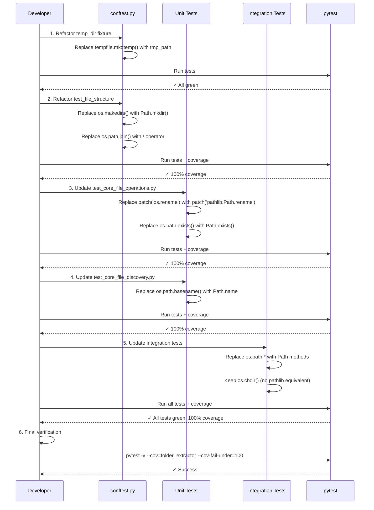

I have created the following plan after thorough exploration and analysis of the codebase. Follow the below plan verbatim. Trust the files and references. Do not re-verify what's written in the plan. Explore only when absolutely necessary. First implement all the proposed file changes and then I'll review all the changes together at the end.

## Beobachtungen

Die Test-Infrastruktur nutzt aktuell eine Mischung aus `os.path`, `tempfile.mkdtemp()` und bereits moderneren `pathlib.Path` Objekten. Die Hauptprobleme befinden sich in `file:tests/conftest.py` (Fixtures mit `os.makedirs`, `os.path.join`, `tempfile.mkdtemp`), `file:tests/unit/test_core_file_operations.py` (Mock für `os.rename`), `file:tests/unit/test_core_file_discovery.py` (`os.path.basename`), und den Integration-Tests (`os.path.exists`, `os.path.abspath`, `os.chdir`). Die meisten Unit-Tests verwenden bereits `Path`-Objekte, aber die Fixtures und einige Assertions müssen noch angepasst werden.

## Ansatz

Der Refactoring-Prozess folgt einem iterativen TDD-Ansatz: Zuerst werden die Fixtures in `conftest.py` auf `pathlib` und pytest's native `tmp_path` umgestellt, dann werden alle verbleibenden `os.path`-Aufrufe in den Test-Dateien durch `Path`-Methoden ersetzt. Mocks für `os.rename` werden durch `pathlib.Path.rename` ersetzt. Nach jeder Änderung wird die Coverage geprüft, um sicherzustellen, dass 100% erhalten bleiben. Die Integration-Tests werden zuletzt angepasst, da sie von den Unit-Test-Änderungen abhängen.

## Implementierungsschritte

### 1. Refactoring von `file:tests/conftest.py`

**Ziel**: Alle `os.path.*`, `os.makedirs()`, `tempfile.mkdtemp()` durch `pathlib.Path` und pytest's `tmp_path` ersetzen.

#### 1.1 Fixture `temp_dir` modernisieren
- **Aktuell** (Zeilen 15-22): Verwendet `tempfile.mkdtemp()` und `os.path.exists()`
- **Änderung**: Ersetze durch pytest's native `tmp_path` Fixture
  ```python
  @pytest.fixture
  def temp_dir(tmp_path):
      """Create a temporary directory for testing."""
      yield str(tmp_path)
      # Cleanup handled automatically by pytest
  ```
- **Begründung**: `tmp_path` ist pytest-native, automatisches Cleanup, keine manuelle Verwaltung nötig

#### 1.2 Fixture `test_file_structure` auf `pathlib` umstellen
- **Aktuell** (Zeilen 25-55): Verwendet `os.makedirs()` und `os.path.join()`
- **Änderungen**:
  - Zeile 12: `os.path.dirname(os.path.dirname(os.path.abspath(__file__)))` → `Path(__file__).parent.parent`
  - Zeilen 29-32: `os.makedirs(os.path.join(...))` → `(Path(temp_dir) / "subdir1").mkdir(parents=True)`
  - Zeile 50: `os.path.join(temp_dir, file_path)` → `str(Path(temp_dir) / file_path)`
- **Type Hint**: Parameter `temp_dir` bleibt `str` für Kompatibilität, intern wird `Path` verwendet

#### 1.3 Fixture `safe_test_dir` anpassen
- **Aktuell** (Zeilen 58-66): Bereits `Path`-basiert, aber verwendet `shutil.rmtree()`
- **Änderung**: Zeile 66: `shutil.rmtree(desktop)` → `shutil.rmtree(desktop)` (bleibt, da `Path.rmdir()` nur leere Verzeichnisse löscht)
- **Hinweis**: `shutil.rmtree()` ist hier korrekt, da rekursives Löschen benötigt wird

### 2. Refactoring von `file:tests/unit/test_core_file_operations.py`

**Ziel**: `os.path` Mocks durch `pathlib.Path` Mocks ersetzen.

#### 2.1 Mock für `os.rename` ersetzen (Zeile 88)
- **Aktuell**: `with patch('os.rename', side_effect=OSError):`
- **Änderung**: `with patch('pathlib.Path.rename', side_effect=OSError):`
- **Begründung**: Die Produktivcode-Datei `file:folder_extractor/core/file_operations.py` verwendet `os.rename()` (Zeile 87), aber nach dem Refactoring wird sie `Path.rename()` verwenden
- **Wichtig**: Dieser Mock muss angepasst werden, nachdem `file_operations.py` refactored wurde (bereits in Phase 3 geschehen)

#### 2.2 Assertion `os.path.exists` ersetzen (Zeile 173)
- **Aktuell**: `assert os.path.exists(history_file)`
- **Änderung**: `assert Path(history_file).exists()`
- **Begründung**: Konsistenz mit `pathlib`

### 3. Refactoring von `file:tests/unit/test_core_file_discovery.py`

**Ziel**: `os.path.basename` durch `Path.name` ersetzen.

#### 3.1 Zeile 40 anpassen
- **Aktuell**: `filenames = [os.path.basename(f) for f in files]`
- **Änderung**: `filenames = [Path(f).name for f in files]`
- **Begründung**: `Path.name` ist das `pathlib`-Äquivalent zu `os.path.basename()`

### 4. Refactoring von `file:tests/integration/test_backward_compatibility.py`

**Ziel**: `os.path.*` durch `pathlib.Path` ersetzen, `os.chdir` bleibt.

#### 4.1 Zeile 17: Pfad-Berechnung modernisieren
- **Aktuell**: `sys.path.insert(0, os.path.abspath(os.path.join(os.path.dirname(__file__), '../..')))`
- **Änderung**: `sys.path.insert(0, str(Path(__file__).parent.parent.parent))`
- **Begründung**: Klarere Pfad-Navigation mit `pathlib`

#### 4.2 Zeile 29: `os.chdir` bleibt
- **Aktuell**: `os.chdir(self.original_cwd)`
- **Keine Änderung**: `os.chdir()` hat kein direktes `pathlib`-Äquivalent, bleibt als `os.chdir()`
- **Hinweis**: `Path.cwd()` liest nur, ändert nicht das Verzeichnis

#### 4.3 Zeile 37: `os.path.exists` ersetzen
- **Aktuell**: `if os.path.exists(self.test_dir):`
- **Änderung**: `if Path(self.test_dir).exists():`

### 5. Refactoring von `file:tests/integration/test_extraction_workflow.py`

**Ziel**: Analog zu `test_backward_compatibility.py`.

#### 5.1 Zeilen 33, 51: `os.chdir` bleibt
- **Keine Änderung**: `os.chdir(self.original_cwd)` bleibt

#### 5.2 Zeilen 39, 214: `os.path.exists` ersetzen
- **Aktuell**: `if os.path.exists(self.test_dir):`
- **Änderung**: `if Path(self.test_dir).exists():`

### 6. Imports aktualisieren

**Alle betroffenen Test-Dateien**:
- Entferne ungenutzte `import os` (falls `os.chdir` nicht verwendet wird)
- Entferne `import tempfile` aus `conftest.py`
- Stelle sicher, dass `from pathlib import Path` vorhanden ist

### 7. Verifikation nach jedem Schritt

Nach jeder Datei-Änderung:

```bash
# Tests ausführen
pytest tests/unit/test_validators.py -v
pytest tests/unit/test_core_file_operations.py -v
pytest tests/unit/test_core_file_discovery.py -v
pytest tests/integration/ -v

# Coverage prüfen
pytest --cov=folder_extractor --cov-report=term-missing --cov-fail-under=100

# Alle Tests
pytest -v
```

**Erwartetes Ergebnis**: Alle Tests grün, 100% Coverage.

## Mermaid-Diagramm: Refactoring-Workflow



## Zusammenfassung der Änderungen

| Datei | Änderungen | Zeilen |
|-------|-----------|--------|
| `file:tests/conftest.py` | `tempfile.mkdtemp()` → `tmp_path`, `os.makedirs()` → `Path.mkdir()`, `os.path.join()` → `/` | 12, 18-22, 29-32, 50 |
| `file:tests/unit/test_core_file_operations.py` | `patch('os.rename')` → `patch('pathlib.Path.rename')`, `os.path.exists()` → `Path.exists()` | 88, 173 |
| `file:tests/unit/test_core_file_discovery.py` | `os.path.basename()` → `Path.name` | 40 |
| `file:tests/integration/test_backward_compatibility.py` | `os.path.abspath(...)` → `Path(...).parent`, `os.path.exists()` → `Path.exists()` | 17, 37 |
| `file:tests/integration/test_extraction_workflow.py` | `os.path.exists()` → `Path.exists()` | 39, 214 |

**Wichtige Hinweise**:
- `os.chdir()` bleibt, da `pathlib` keine Alternative bietet
- `shutil.rmtree()` bleibt für rekursives Löschen
- `tmp_path` Fixture ist pytest-native (ab pytest 3.9+)
- Alle Änderungen sind rückwärtskompatibel, da String-Pfade weiterhin akzeptiert werden