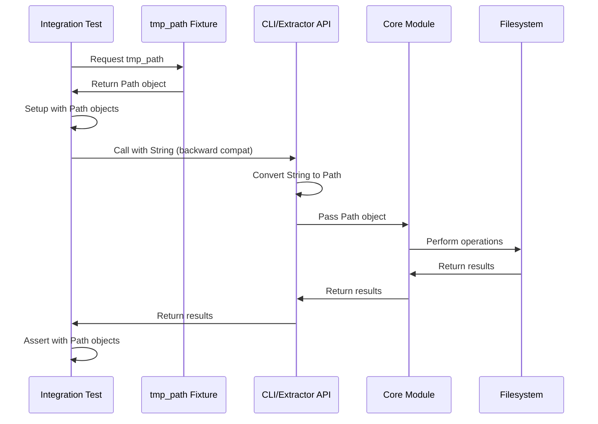

I have created the following plan after thorough exploration and analysis of the codebase. Follow the below plan verbatim. Trust the files and references. Do not re-verify what's written in the plan. Explore only when absolutely necessary. First implement all the proposed file changes and then I'll review all the changes together at the end.

## Beobachtungen

Die Integration-Tests verwenden aktuell `tempfile.mkdtemp()` statt pytest's native `tmp_path` Fixture und nutzen `os.getcwd()`, `os.chdir()`, `os.path.exists()` für Pfad-Operationen. Die Tests prüfen bereits die Backward-Kompatibilität mit String-Eingaben, aber die Test-Implementierung selbst nutzt noch veraltete `os.path`-Methoden. Die Core-Module (`extractor_v2.py`, `app_v2.py`) akzeptieren String-Parameter an ihren öffentlichen Schnittstellen, was für die API-Kompatibilität wichtig ist.

## Ansatz

Der Refactoring-Ansatz folgt dem TDD-Prinzip: Zuerst werden die Tests auf `pathlib` umgestellt, während die Backward-Kompatibilität durch explizite Tests für String-Eingaben sichergestellt wird. Die Test-Fixtures werden auf pytest's `tmp_path` migriert, und alle internen Pfad-Operationen nutzen `pathlib.Path`. Die API-Tests in `test_backward_compatibility.py` stellen sicher, dass String-Eingaben weiterhin funktionieren, während die Workflow-Tests in `test_extraction_workflow.py` die vollständige Integration mit Path-Objekten validieren.

## Implementierungsschritte

### 1. Refactoring: `test_backward_compatibility.py` - Setup/Teardown auf pathlib

**Datei:** `file:tests/integration/test_backward_compatibility.py`

Ersetze in den Methoden `setup_method()` und `teardown_method()`:
- `tempfile.mkdtemp(dir=str(desktop), prefix="...")` durch pytest's `tmp_path` Fixture
- `os.getcwd()` durch `Path.cwd()`
- `os.chdir()` durch `os.chdir(Path(...))`
- `os.path.exists()` durch `Path(...).exists()`
- `shutil.rmtree()` kann beibehalten werden, da pytest's `tmp_path` automatisch aufräumt

**Änderungen:**
- Konvertiere `setup_method()` zu einer Fixture-basierten Lösung oder nutze `tmp_path` als Parameter
- Ersetze `self.test_dir = tempfile.mkdtemp(...)` durch `self.test_dir = tmp_path / "test_compat"`
- Ersetze `self.original_cwd = os.getcwd()` durch `self.original_cwd = Path.cwd()`
- Ersetze `os.chdir(self.original_cwd)` durch `os.chdir(self.original_cwd)`
- Ersetze `if os.path.exists(self.test_dir):` durch `if Path(self.test_dir).exists():`

### 2. Refactoring: `test_backward_compatibility.py` - Test-Methoden auf pathlib

**Datei:** `file:tests/integration/test_backward_compatibility.py`

Aktualisiere alle Test-Methoden:
- `test_legacy_history_format_reading()`: Nutze `Path` für `history_file` Konstruktion
- `test_enhanced_cli_with_legacy_args()`: Nutze `Path` für Verzeichnis-Erstellung, aber teste mit String-Argumenten
- `test_main_selector_legacy_fallback()`: Nutze `Path` für Verzeichnis-Erstellung
- `test_mixed_history_format()`: Nutze `Path` für alle Pfad-Operationen
- Alle anderen Tests: Ersetze `os.path.join()` durch `/` Operator mit Path-Objekten

**Wichtig:** Die Tests müssen weiterhin String-Eingaben an die API übergeben, um Backward-Kompatibilität zu validieren. Nur die Test-Infrastruktur selbst nutzt `pathlib`.

### 3. Refactoring: `test_extraction_workflow.py` - Setup/Teardown auf pathlib

**Datei:** `file:tests/integration/test_extraction_workflow.py`

Analog zu `test_backward_compatibility.py`:
- Ersetze `tempfile.mkdtemp()` durch `tmp_path` Fixture
- Ersetze `os.getcwd()` durch `Path.cwd()`
- Ersetze `os.chdir()` durch `os.chdir(Path(...))`
- Ersetze `os.path.exists()` durch `Path(...).exists()`

**Änderungen:**
- In `TestExtractionWorkflow.setup_method()`: Nutze `tmp_path` statt `tempfile.mkdtemp()`
- In `TestUndoWorkflow.setup_method()`: Nutze `tmp_path` statt `tempfile.mkdtemp()`
- In `TestStateManagement.test_operation_tracking()`: Nutze `tmp_path` statt `tempfile.TemporaryDirectory()`

### 4. Refactoring: `test_extraction_workflow.py` - Test-Methoden auf pathlib

**Datei:** `file:tests/integration/test_extraction_workflow.py`

Aktualisiere alle Test-Methoden:
- `create_test_structure()`: Nutze `Path` für alle Verzeichnis- und Datei-Operationen (bereits teilweise vorhanden)
- `test_security_validation()`: Ersetze `tempfile.mkdtemp(dir="/tmp")` durch `tmp_path / "unsafe"`
- Alle Tests: Ersetze `os.chdir()` Aufrufe mit Path-Objekten

### 5. TDD-Schritt: Neue Tests für String-zu-Path-Konvertierung

**Datei:** `file:tests/integration/test_backward_compatibility.py`

Füge neue Test-Methoden hinzu, um explizit zu validieren, dass String-Eingaben korrekt in Path-Objekte konvertiert werden:

```python
def test_string_path_acceptance_in_extractor():
    """Test dass EnhancedFileExtractor String-Pfade akzeptiert."""
    # Test mit String-Pfad
    # Validiere dass keine Fehler auftreten
    
def test_string_path_acceptance_in_orchestrator():
    """Test dass EnhancedExtractionOrchestrator String-Pfade akzeptiert."""
    # Test mit String-Pfad
    # Validiere dass keine Fehler auftreten
```

Diese Tests stellen sicher, dass die API-Kompatibilität gewahrt bleibt.

### 6. Verify: Integration-Tests ausführen

Führe alle Integration-Tests aus:
```bash
pytest tests/integration/ -v
```

Prüfe die Coverage für die Integration-Tests:
```bash
pytest tests/integration/ --cov=folder_extractor --cov-report=term-missing
```

Stelle sicher, dass:
- Alle Tests erfolgreich durchlaufen
- Keine `DeprecationWarnings` bezüglich Pfad-Handling auftreten
- String-Eingaben weiterhin funktionieren (Backward-Kompatibilität)

### 7. Verify: Vollständige Coverage-Prüfung

Führe alle Tests aus und prüfe die Coverage:
```bash
pytest --cov=folder_extractor --cov-report=term-missing --cov-fail-under=100
```

Falls die Coverage unter 100% fällt:
- Identifiziere fehlende Test-Abdeckung
- Füge fehlende Tests hinzu
- Wiederhole die Coverage-Prüfung

## Architektur-Übersicht



## Wichtige Hinweise

| Aspekt | Details |
|--------|---------|
| **Backward Compatibility** | API-Schnittstellen akzeptieren weiterhin `str` oder `Union[str, Path]` |
| **Test-Fixtures** | Nutze pytest's `tmp_path` statt `tempfile.mkdtemp()` |
| **Path-Konvertierung** | Konvertiere Strings so früh wie möglich zu Path-Objekten |
| **os.chdir()** | Kann beibehalten werden, akzeptiert auch Path-Objekte (Python 3.6+) |
| **Coverage-Ziel** | 100% - keine Ausnahmen |

## Definition of Done

- ✅ Alle Integration-Tests nutzen `pathlib.Path` für interne Operationen
- ✅ Tests nutzen pytest's `tmp_path` Fixture statt `tempfile.mkdtemp()`
- ✅ String-Eingaben werden explizit getestet (Backward-Kompatibilität)
- ✅ Alle Integration-Tests laufen erfolgreich durch
- ✅ Coverage bleibt bei 100%
- ✅ Keine `DeprecationWarnings` bezüglich Pfad-Handling