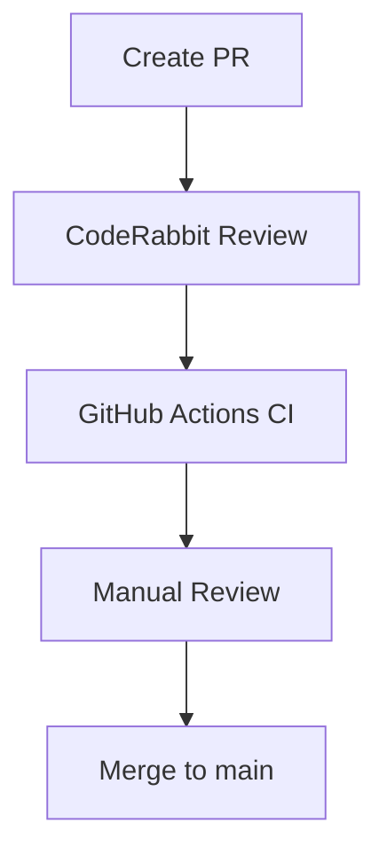

# CodeRabbit Setup for Folder Extractor

## 🎉 Welcome to CodeRabbit!

This guide helps you set up **CodeRabbit** with the Folder Extractor repository.

## 🔧 Prerequisites

- GitHub repository created and pushed
- CodeRabbit account (sign up at [coderabbit.ai](https://coderabbit.ai))
- Admin access to the GitHub repository

## 🚀 Setup Instructions

### 1. Install CodeRabbit GitHub App

1. Go to [CodeRabbit GitHub App](https://github.com/apps/coderabbit)
2. Click "Install" and select your account
3. Choose the `folder-extractor` repository
4. Install with **All repositories** or **Only selected repositories**

### 2. Configure Repository Settings

1. Go to your GitHub repository settings
2. Navigate to **Branches** → **Branch protection rules**
3. Add a new rule for the `main` branch:
   - **Require a pull request before merging** ✅
   - **Require approvals** (1-2)
   - **Require status checks to pass before merging** ✅
   - **Require branches to be up to date before merging** ✅
   - **Include administrators** ✅

### 3. CodeRabbit Configuration

1. Create a `.coderabbit.yaml` file in the repository root:

```yaml
# .coderabbit.yaml
version: 1

language: python

reviews:
  profile: balanced
  auto_review:
    enabled: true
    comment: "CodeRabbit AI Review"
  
  paths:
    include:
      - "folder_extractor/**/*.py"
      - "tests/**/*.py"
    exclude:
      - "**/__pycache__/**"
      - "**/*.pyc"
      - "setup.py"

pr_description:
  auto_generate:
    enabled: true
    style: detailed

pr_title:
  auto_generate:
    enabled: true
    prefix: "[AUTO]"

chat:
  auto_reply: true
  model: gpt-4
```

### 4. Commit and Push Configuration

```bash
cd /Users/philippbriese/Documents/dev/dump/Folder\ Extractor
git add .coderabbit.yaml
git commit -m "feat: add CodeRabbit configuration"
git push origin main
```

## 🤖 CodeRabbit Features

### Automatic Code Reviews
- **AI-powered code analysis** for every pull request
- **Style and quality checks** based on Python best practices
- **Security vulnerability detection**
- **Performance optimization suggestions**

### Pull Request Automation
- **Auto-generated PR descriptions** with detailed analysis
- **Auto-generated PR titles** with clear prefixes
- **Smart suggestions** for improvements

### Chat Integration
- **AI chat assistant** for code questions
- **Context-aware responses** based on your codebase
- **Multi-file analysis** for complex questions

## 📋 Best Practices with CodeRabbit

### 1. Pull Request Workflow

1. **Create feature branch**:
   ```bash
   git checkout -b feature/your-feature
   ```

2. **Make changes** and commit with clear messages

3. **Push branch**:
   ```bash
   git push origin feature/your-feature
   ```

4. **Create Pull Request** on GitHub

5. **CodeRabbit will automatically**:
   - Analyze the code
   - Provide detailed review
   - Suggest improvements
   - Check for vulnerabilities

### 2. Addressing CodeRabbit Feedback

- **Review suggestions** carefully
- **Fix issues** marked as critical
- **Consider improvements** for better code quality
- **Use chat** to ask for clarification

### 3. Merging Process

1. **All checks pass** (CI/CD + CodeRabbit)
2. **Required approvals** are obtained
3. **No critical issues** remain
4. **Merge with confidence**

## 🎯 CodeRabbit Configuration Tips

### Customizing Review Profile

```yaml
reviews:
  profile: strict  # Options: lenient, balanced, strict, very_strict
```

### Focusing on Specific Areas

```yaml
reviews:
  focus_areas:
    - security
    - performance
    - maintainability
    - documentation
```

### Ignoring Specific Files

```yaml
reviews:
  paths:
    exclude:
      - "tests/fixtures/**"
      - "docs/**"
      - "*.md"
```

## 📊 Integration with Existing Workflows

### GitHub Actions + CodeRabbit

The repository's GitHub Actions workflows work seamlessly with CodeRabbit:

1. **CodeRabbit analyzes** the code first
2. **GitHub Actions runs** tests and linting
3. **Both must pass** before merging

### Example Workflow



## 🤔 Troubleshooting

### CodeRabbit Not Reviewing

1. **Check GitHub App installation**
2. **Verify repository access**
3. **Ensure `.coderabbit.yaml` exists**
4. **Check branch protection rules**

### False Positives

1. **Use chat** to ask for clarification
2. **Add comments** explaining the code
3. **Configure exceptions** in `.coderabbit.yaml`

## 🎉 Benefits of CodeRabbit

✅ **Faster code reviews** - AI assists human reviewers  
✅ **Higher code quality** - Consistent style and best practices  
✅ **Better security** - Automatic vulnerability detection  
✅ **Knowledge sharing** - AI explains complex code  
✅ **Onboarding help** - New developers get instant feedback  

## 📚 Resources

- [CodeRabbit Documentation](https://docs.coderabbit.ai)
- [Python Best Practices](https://peps.python.org/pep-0008/)
- [GitHub Actions Docs](https://docs.github.com/en/actions)

---

**Happy Coding with CodeRabbit!** 🚀