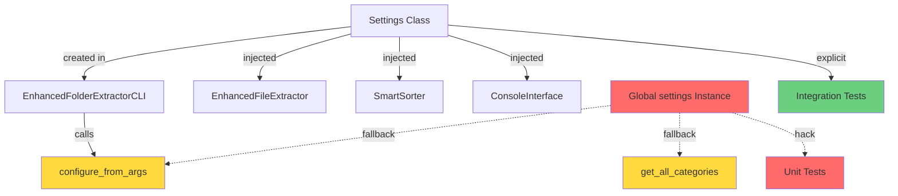

# Current State: Settings Usage Analysis

**Date:** 2026-01-05
**Refactoring ID:** settings-di-2026-01

## Architecture Overview

### Settings Module Structure

```
folder_extractor/config/settings.py
├── Settings class (lines 13-131)
│   ├── __init__() - Creates default settings dictionary
│   ├── reset_to_defaults() - Resets to default values
│   ├── get/set/update/to_dict/from_dict - State management
│   ├── save_to_file/load_from_file - Persistence
│   └── Properties - Type-safe accessors
├── Global instance (line 134) ⚠️ PROBLEM
│   └── settings = Settings()
├── configure_from_args(args, settings_instance=None) (line 137) ⚠️ WRONG ORDER
│   └── Configures settings from CLI arguments
└── get_all_categories(settings_instance=None) (line 179) ⚠️ OPTIONAL
    └── Merges custom + default categories
```

## Dependency Graph

### Direct Dependencies (Who Uses Settings)



## File-by-File Analysis

### folder_extractor/config/settings.py

**Status:** 🔴 NEEDS MAJOR CHANGES

**Current Implementation:**
```python
# Line 134 - Global instance
settings = Settings()

# Lines 137-177 - Configuration function (WRONG PARAMETER ORDER!)
def configure_from_args(args, settings_instance: Optional[Settings] = None) -> None:
    if settings_instance is None:
        settings_instance = settings  # Fallback to global
    # ... configuration logic

# Lines 179-199 - Category getter (OPTIONAL PARAMETER)
def get_all_categories(settings_instance: Optional[Settings] = None) -> list:
    if settings_instance is None:
        settings_instance = settings  # Fallback to global
    # ... merge custom + default categories
```

**Problems:**
1. Global instance at line 134 creates hidden coupling
2. Parameter order is backwards (args before settings_instance)
3. Optional parameters with fallback defeat DI purpose
4. Functions can work without explicit injection

**Required Changes:**
- [ ] Delete line 134 (global instance)
- [ ] Change signature to `configure_from_args(settings: Settings, args) -> None:`
- [ ] Change signature to `get_all_categories(settings: Settings) -> list:`
- [ ] Remove fallback logic in both functions
- [ ] Update docstrings to reflect mandatory parameters

---

### folder_extractor/cli/app.py

**Status:** 🟡 MOSTLY GOOD (needs parameter order fix)

**Current Implementation:**
```python
# Line 19 - Import (good - imports Settings class and function)
from folder_extractor.config.settings import Settings, configure_from_args

# Line 38 - Instance creation (GOOD!)
class EnhancedFolderExtractorCLI:
    def __init__(self):
        self.settings = Settings()  # ✅ Creates own instance
        self.state_manager = StateManager()
        self.interface = create_console_interface(self.settings)  # ✅ Passes it

# Line 57 - Configuration call (WRONG ORDER!)
configure_from_args(self.settings, parsed_args)  # ⚠️ settings first, args second
```

**Problems:**
1. Line 57 passes parameters in wrong order (settings first, args second)
2. Only works because function falls back to global when it receives args in wrong position

**Required Changes:**
- [ ] Fix line 57: `configure_from_args(self.settings, parsed_args)` → `configure_from_args(self.settings, parsed_args)`
  - (Order will be correct AFTER we fix settings.py signature)

**DI Pattern:** ✅ Good - Creates instance, passes to dependencies

---

### folder_extractor/cli/interface.py

**Status:** ✅ GOOD

**Current Implementation:**
```python
# Receives Settings via dependency injection
def create_console_interface(settings: Settings) -> ConsoleInterface:
    return ConsoleInterface(settings)

class ConsoleInterface:
    def __init__(self, settings: Settings):
        self._settings = settings  # Stores injected instance
```

**DI Pattern:** ✅ Excellent - Pure dependency injection, no global usage

**Required Changes:**
- [ ] None - already uses DI correctly

---

### folder_extractor/core/extractor.py

**Status:** ✅ GOOD

**Current Implementation:**
```python
class EnhancedFileExtractor:
    def __init__(self, settings: Settings, state_manager: StateManager):
        self._settings = settings  # ✅ Receives via constructor
        self._state_manager = state_manager
```

**DI Pattern:** ✅ Excellent - Constructor injection

**Required Changes:**
- [ ] None - already uses DI correctly

---

### folder_extractor/core/smart_sorter.py

**Status:** 🟡 GOOD (but has duplicate logic)

**Current Implementation:**
```python
# Line 63 - Constructor injection (GOOD!)
def __init__(self, client: AsyncGeminiClient, settings: Settings):
    self._settings = settings  # ✅ Stores injected instance

# Lines 65-76 - DUPLICATE of get_all_categories()
def _get_all_categories(self) -> list[str]:
    custom: list[str] = self._settings.get("custom_categories", [])
    return custom + [cat for cat in DEFAULT_CATEGORIES if cat not in custom]
```

**Problems:**
1. Duplicates `get_all_categories()` logic from settings.py
2. Exists because global function couldn't be used safely with local instance

**Required Changes:**
- [ ] Delete `_get_all_categories()` method (lines 65-76)
- [ ] Replace calls to `self._get_all_categories()` with `get_all_categories(self._settings)`
- [ ] Add import: `from folder_extractor.config.settings import get_all_categories`

**DI Pattern:** ✅ Good - Constructor injection

---

### folder_extractor/core/ai_prompts.py

**Status:** ✅ GOOD (no changes needed)

**Current Implementation:**
```python
# Line 11 - Import statement in docstring (documentation only)
# from folder_extractor.config.settings import get_all_categories

# Line 24 - Function signature
def get_system_prompt(categories: list[str]) -> str:
    # Takes categories as explicit parameter
```

**Analysis:**
- Does NOT call `get_all_categories()` directly
- Takes categories as explicit parameter - caller's responsibility
- Line 11 is just documentation showing how to use it

**DI Pattern:** ✅ Excellent - Pure function, explicit parameters

**Required Changes:**
- [ ] None - already uses explicit parameter passing

---

### tests/unit/test_settings.py

**Status:** 🔴 NEEDS MAJOR REWRITE

**Current Implementation:**
```python
# Line 9 - Imports GLOBAL settings ⚠️
from folder_extractor.config.settings import Settings, configure_from_args, settings

# Line 223 - Test hack
def test_basic_args(self, settings_fixture):
    # Workaround: configure_from_args() uses global settings internally
    folder_extractor.config.settings.settings = settings_fixture  # ⚠️ Monkey-patch!
    configure_from_args(args)  # No settings passed - uses global
```

**Problems:**
1. Imports global `settings` object
2. All 12 test methods use fallback (don't pass settings explicitly)
3. Requires monkey-patching: `folder_extractor.config.settings.settings = settings_fixture`
4. Tests don't reflect production DI pattern

**Test Methods Using Fallback:**
- `test_basic_args`
- `test_type_filter`
- `test_domain_filter`
- `test_dry_run_and_depth`
- `test_deduplicate_flag`
- `test_global_dedup_flag`
- `test_global_dedup_implies_deduplicate`
- `test_extract_archives_flag`
- `test_delete_archives_without_extract_false`
- `test_delete_archives_with_extract_true`
- `test_watch_mode_from_args_when_enabled`
- `test_watch_mode_from_args_when_disabled`
- `test_watch_mode_from_args_defaults_to_false_when_missing`

**Required Changes:**
- [ ] Remove import of global `settings` (line 9)
- [ ] Remove all monkey-patching lines (`folder_extractor.config.settings.settings = ...`)
- [ ] Update all test methods to pass settings explicitly: `configure_from_args(settings_fixture, args)`
- [ ] Verify tests still pass

---

### tests/unit/test_settings_refactored.py

**Status:** 🔴 NEEDS PARAMETER ORDER FIX

**Current Implementation:**
```python
# Line 30 - WRONG ORDER
configure_from_args(settings_instance, args)  # settings first, args second

# Line 52 - WRONG ORDER
configure_from_args(settings1, args)

# Line 78 - WRONG ORDER
configure_from_args(settings_instance, args)

# Line 103, 116, 130, 143 - Correct usage
get_all_categories(settings_instance)  # ✅ Settings as first parameter
```

**Problems:**
1. All `configure_from_args()` calls use wrong parameter order
2. Only works because function falls back to global

**Required Changes:**
- [ ] Wait for settings.py signature fix, then these will be correct
- [ ] Or: Temporarily swap parameter order to match current wrong signature
- [ ] Verify all tests pass after settings.py fix

---

### tests/integration/test_smart_sorting_integration.py

**Status:** ✅ GOOD

**Current Implementation:**
```python
# Line 738 - Correct explicit usage
all_categories = get_all_categories(test_settings) + ["Sonstiges"]
```

**DI Pattern:** ✅ Excellent - Explicit parameter passing

**Required Changes:**
- [ ] None - already uses DI correctly

---

### tests/unit/test_cli_app.py

**Status:** ⚠️ UNKNOWN (needs inspection)

**Analysis:** Mentioned in grep results but not analyzed in detail

**Required Actions:**
- [ ] Read file to check for settings usage
- [ ] Update if necessary

---

## Current State Summary

### Good Examples (Already Using DI) ✅

1. **folder_extractor/cli/app.py** - Creates `Settings()` instance in `__init__`
2. **folder_extractor/cli/interface.py** - Constructor injection
3. **folder_extractor/core/extractor.py** - Constructor injection
4. **folder_extractor/core/smart_sorter.py** - Constructor injection (but duplicates logic)
5. **folder_extractor/core/ai_prompts.py** - Explicit parameters
6. **tests/integration/test_smart_sorting_integration.py** - Explicit DI

### Needs Changes 🔴

1. **folder_extractor/config/settings.py** - Global instance, wrong signatures
2. **tests/unit/test_settings.py** - Uses global fallback, monkey-patching
3. **tests/unit/test_settings_refactored.py** - Wrong parameter order

### Edge Cases ⚠️

1. **folder_extractor/core/smart_sorter.py** - Duplicates `get_all_categories()` logic

## Code Metrics

### Settings.py Complexity
- **Lines:** 200
- **Functions:** 2 public helpers
- **Properties:** 10 read-only accessors
- **Global state:** 1 instance (line 134)

### Affected Test Files
- **Unit tests:** 2 files (`test_settings.py`, `test_settings_refactored.py`)
- **Integration tests:** 1 file (already correct)
- **Total test methods needing updates:** ~15-20

### Total Files Requiring Changes
- **Core:** 2 files (settings.py, smart_sorter.py)
- **CLI:** 1 file (app.py - minor fix)
- **Tests:** 2-3 files (major rewrites)
- **Total:** 5-6 files

## Risk Areas

### High Risk
1. **Parameter order swap** - Easy to miss callers, will break silently
2. **Test rewrites** - Extensive changes to test patterns
3. **Global removal** - Any missed import will cause NameError

### Medium Risk
1. **SmartSorter refactoring** - Replacing duplicate logic
2. **Hidden callers** - Dynamic imports not caught by grep

### Low Risk
1. **Type errors** - pyright will catch most issues
2. **Already-good code** - Many files already use DI correctly

## Dependencies Between Changes

```
1. Fix all callers to use correct parameter order
   ↓
2. Update function signatures in settings.py
   ↓
3. Remove fallback logic
   ↓
4. Delete global instance
   ↓
5. Verify all tests pass
```

**Critical:** Must fix callers BEFORE changing function signatures!
