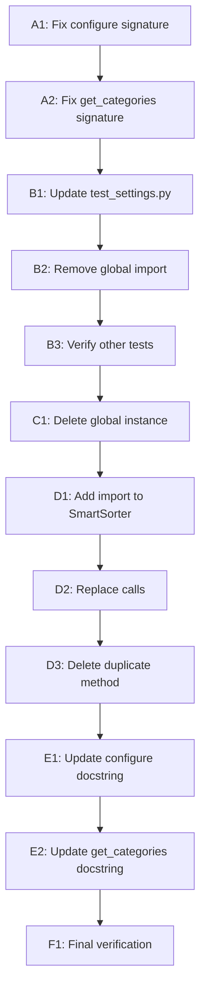

# Incremental Steps: Settings DI Refactoring

**Date:** 2026-01-05
**Refactoring ID:** settings-di-2026-01

## Overview

This document breaks down the refactoring into the smallest possible atomic steps.

**Principle:** Each step should ideally keep tests GREEN (or maintain known failure state).

---

## Step Sequence

### Phase A: Update Function Signatures (settings.py) [2 steps]

**Goal:** Fix parameter order and make Settings mandatory

#### Step A1: Fix `configure_from_args()` Signature ✅

**Current:**
```python
def configure_from_args(args, settings_instance: Optional[Settings] = None) -> None:
    if settings_instance is None:
        settings_instance = settings
```

**Change To:**
```python
def configure_from_args(settings: Settings, args) -> None:
    # No fallback logic - parameter is mandatory
```

**Files Modified:** `folder_extractor/config/settings.py`

**Lines Changed:**
- Line 137: Function signature
- Lines 144-145: Remove fallback logic
- All `settings_instance` references → `settings`

**Expected Result:**
- `test_settings_refactored.py` tests NOW PASS (parameter order fixed)
- `test_settings.py` tests NOW FAIL (no longer have fallback)
- CLI app.py call NOW WORKS (was accidentally correct order)

**Verification:**
```bash
pytest tests/unit/test_settings_refactored.py::TestConfigureFromArgsWithExplicitSettings -v
# Should show 3 PASSED (were failing before)
```

---

#### Step A2: Fix `get_all_categories()` Signature ✅

**Current:**
```python
def get_all_categories(settings_instance: Optional[Settings] = None) -> list:
    if settings_instance is None:
        settings_instance = settings
```

**Change To:**
```python
def get_all_categories(settings: Settings) -> list[str]:
    # No fallback logic - parameter is mandatory
```

**Files Modified:** `folder_extractor/config/settings.py`

**Lines Changed:**
- Line 179: Function signature
- Lines 192-193: Remove fallback logic
- All `settings_instance` references → `settings`

**Expected Result:**
- `test_settings_refactored.py` tests STILL PASS (already correct)
- Integration tests STILL PASS (already use explicit parameter)
- Callers without explicit parameter NOW FAIL (intentional - will fix next)

**Verification:**
```bash
pytest tests/unit/test_settings_refactored.py::TestGetAllCategoriesWithExplicitSettings -v
# Should show 4 PASSED
```

**Break Condition:**
If any currently-passing test FAILS unexpectedly, investigate before proceeding.

---

### Phase B: Fix Test Files [2-3 steps]

**Goal:** Update tests to use explicit DI (no monkey-patching)

#### Step B1: Update `test_settings.py` - configure_from_args() Tests ✅

**Current Pattern:**
```python
def test_basic_args(self, settings_fixture):
    folder_extractor.config.settings.settings = settings_fixture  # Monkey-patch
    configure_from_args(args)  # Implicit global
```

**Change To:**
```python
def test_basic_args(self, settings_fixture):
    # No monkey-patch
    configure_from_args(settings_fixture, args)  # Explicit DI
```

**Files Modified:** `tests/unit/test_settings.py`

**Lines Changed:** ~12 test methods

**Test Methods to Update:**
1. `test_basic_args` (line ~220)
2. `test_type_filter` (line ~245)
3. `test_domain_filter` (line ~265)
4. `test_dry_run_and_depth` (line ~283)
5. `test_deduplicate_flag` (line ~305)
6. `test_global_dedup_flag` (line ~325)
7. `test_global_dedup_implies_deduplicate` (line ~345)
8. `test_extract_archives_flag` (line ~363)
9. `test_delete_archives_without_extract_false` (line ~385)
10. `test_delete_archives_with_extract_true` (line ~410)
11. `test_watch_mode_from_args_when_enabled` (line ~420)
12. `test_watch_mode_from_args_when_disabled` (line ~441)
13. `test_watch_mode_from_args_defaults_to_false_when_missing` (line ~462)

**Pattern:**
- Remove: `folder_extractor.config.settings.settings = settings_fixture`
- Change: `configure_from_args(args)` → `configure_from_args(settings_fixture, args)`

**Expected Result:**
- All 13 updated tests PASS
- No other tests affected

**Verification:**
```bash
pytest tests/unit/test_settings.py::TestConfigureFromArgs -v
# Should show all PASSED
```

---

#### Step B2: Remove Global Import from `test_settings.py` ✅

**Current:**
```python
# Line 9
from folder_extractor.config.settings import Settings, configure_from_args, settings
```

**Change To:**
```python
# Line 9
from folder_extractor.config.settings import Settings, configure_from_args
# Removed: settings (global instance)
```

**Files Modified:** `tests/unit/test_settings.py`

**Lines Changed:** Line 9 only

**Expected Result:**
- No test failures (global no longer used after Step B1)
- Verifies no hidden dependencies on global

**Verification:**
```bash
pytest tests/unit/test_settings.py -v
# Should show all PASSED
```

**Break Condition:**
If removing import causes ANY failure, it means we missed a usage in Step B1.

---

#### Step B3: Verify All Test Files ✅

**Goal:** Ensure no other test files import or use the global

**Check:**
```bash
grep -r "from.*settings import.*\bsettings\b" tests/
# Should return ZERO results (no imports of global)

grep -r "folder_extractor.config.settings.settings =" tests/
# Should return ZERO results (no monkey-patching)
```

**Files to Inspect:**
- `tests/unit/test_cli_app.py` - May reference settings
- `tests/integration/*.py` - Should already be clean

**Action:**
If any files found, update them using same pattern as Step B1/B2.

**Expected Result:**
- All tests pass
- No test imports global `settings`
- No test uses monkey-patching

---

### Phase C: Remove Global Instance [1 step]

**Goal:** Delete the global singleton

#### Step C1: Delete Global `settings` Instance ✅

**Current:**
```python
# Line 134 in settings.py
settings = Settings()
```

**Change To:**
```python
# Line 134 deleted - no global instance
```

**Files Modified:** `folder_extractor/config/settings.py`

**Lines Deleted:** Line 134 only

**Expected Result:**
- ALL tests still pass (nothing depends on global anymore)
- Type checker passes
- No NameError at import time

**Verification:**
```bash
# Full test suite
python run_tests.py

# Type checking
pyright folder_extractor/config/settings.py

# Verify deletion
grep -n "^settings = Settings()" folder_extractor/config/settings.py
# Should return ZERO results
```

**Break Condition:**
If deleting global causes NameError or test failures, there's a hidden dependency.
- Revert deletion
- Find missing usage
- Fix it
- Retry

---

### Phase D: Clean Up Duplication [2-3 steps]

**Goal:** Remove duplicate `_get_all_categories()` from SmartSorter

#### Step D1: Add Import to `smart_sorter.py` ✅

**Current:**
```python
# No import of get_all_categories
```

**Change To:**
```python
from folder_extractor.config.settings import get_all_categories
```

**Files Modified:** `folder_extractor/core/smart_sorter.py`

**Lines Changed:** Add import at top of file (around line 20)

**Expected Result:**
- No behavior change
- Import available for next step

**Verification:**
```bash
pytest tests/unit/test_smart_sorter.py -v
# Should show all PASSED (no change yet)
```

---

#### Step D2: Replace `self._get_all_categories()` Calls ✅

**Current:**
```python
categories = self._get_all_categories()
```

**Change To:**
```python
categories = get_all_categories(self._settings)
```

**Files Modified:** `folder_extractor/core/smart_sorter.py`

**Lines Changed:** All call sites of `self._get_all_categories()`

**Find Call Sites:**
```bash
grep -n "self._get_all_categories()" folder_extractor/core/smart_sorter.py
```

**Expected Call Sites:**
- Line ~118: `categories = self._get_all_categories()`
- (Possibly others - verify with grep)

**Expected Result:**
- All SmartSorter tests still pass
- Behavior unchanged (using shared function now)

**Verification:**
```bash
pytest tests/unit/test_smart_sorter.py -v
pytest tests/integration/test_smart_sorting_integration.py -v
# Both should show all PASSED
```

---

#### Step D3: Delete `_get_all_categories()` Method ✅

**Current:**
```python
def _get_all_categories(self) -> list[str]:
    custom: list[str] = self._settings.get("custom_categories", [])
    return custom + [cat for cat in DEFAULT_CATEGORIES if cat not in custom]
```

**Change To:**
```python
# Method deleted (lines 65-76)
```

**Files Modified:** `folder_extractor/core/smart_sorter.py`

**Lines Deleted:** Lines 65-76 (entire method)

**Expected Result:**
- All tests still pass
- Code duplication eliminated
- Single source of truth for category merging

**Verification:**
```bash
pytest tests/unit/test_smart_sorter.py -v
pytest tests/integration/test_smart_sorting_integration.py -v

# Verify no usages remain
grep -n "_get_all_categories" folder_extractor/core/smart_sorter.py
# Should return ZERO results
```

---

### Phase E: Update Documentation [1-2 steps]

**Goal:** Update docstrings and comments

#### Step E1: Update `configure_from_args()` Docstring ✅

**Current:**
```python
"""Configure settings from command line arguments.

Args:
    args: Parsed command line arguments
    settings_instance: Optional settings instance (defaults to global settings)
"""
```

**Change To:**
```python
"""Configure settings from command line arguments.

Args:
    settings: Settings instance to configure (mandatory)
    args: Parsed command line arguments

Note:
    Requires explicit Settings instance - no global fallback.

Example:
    >>> settings = Settings()
    >>> args = parser.parse_args()
    >>> configure_from_args(settings, args)
"""
```

**Files Modified:** `folder_extractor/config/settings.py`

**Expected Result:**
- Documentation reflects new API
- No behavior change

---

#### Step E2: Update `get_all_categories()` Docstring ✅

**Current:**
```python
"""Get combined list of user-defined and default categories.

Args:
    settings_instance: Optional settings instance (defaults to global settings)

Returns:
    List of category names with user categories first.
"""
```

**Change To:**
```python
"""Get combined list of user-defined and default categories.

Args:
    settings: Settings instance to read categories from (mandatory)

Returns:
    List of category names with user categories first.

Example:
    >>> settings = Settings()
    >>> settings.set("custom_categories", ["Work", "Personal"])
    >>> get_all_categories(settings)
    ['Work', 'Personal', 'Finanzen', 'Verträge', ...]
"""
```

**Files Modified:** `folder_extractor/config/settings.py`

**Expected Result:**
- Documentation reflects new API
- No behavior change

---

### Phase F: Final Verification [1 step]

**Goal:** Comprehensive verification of refactoring

#### Step F1: Run Full Verification Suite ✅

**Run All Checks:**

```bash
# 1. Full test suite
python run_tests.py
# Expected: All tests PASS

# 2. Type checking
pyright folder_extractor/
# Expected: Zero errors

# 3. Verify no global instance
grep -n "^settings = Settings()" folder_extractor/config/settings.py
# Expected: No results

# 4. Verify no global imports
grep -r "from.*settings import.*\bsettings\b" tests/
# Expected: No results

# 5. Verify no monkey-patching
grep -r "folder_extractor.config.settings.settings =" tests/
# Expected: No results

# 6. Verify no fallback logic
grep -n "settings_instance = settings" folder_extractor/config/settings.py
# Expected: No results

# 7. Verify duplication removed
grep -n "_get_all_categories" folder_extractor/core/smart_sorter.py
# Expected: No results

# 8. Run integration tests
pytest tests/integration/ -v
# Expected: All PASS

# 9. Verify CLI still works (manual)
cd /Users/philippbriese/Documents/dev/dump/Folder\ Extractor
python -m folder_extractor.cli.app --help
# Expected: Help text displays correctly
```

**Success Criteria:** ALL checks pass ✅

**If Any Check Fails:**
- Identify which step introduced the issue
- Revert that step
- Re-analyze and retry with smaller changes

---

## Step Dependencies



**Critical Path:** A1 → A2 → B1 → B2 → B3 → C1

**Parallel Possible:** D1-D3 can be done independently after C1

---

## Step Size Guidelines

### Too Large (Don't Do This) ❌

```
Step X: "Fix all functions and tests"
- Changes settings.py
- Changes app.py
- Changes 3 test files
- Deletes global
```

**Problem:** Too many changes, hard to debug if broken

### Just Right (Do This) ✅

```
Step X: "Fix configure_from_args signature"
- Changes settings.py only
- Updates 1 function signature
- Tests run after
```

**Good:** Single logical change, easy to verify

### Too Small (Overkill) ⚠️

```
Step X: "Change parameter name from settings_instance to settings"
Step Y: "Change parameter type from Optional to required"
Step Z: "Remove if statement"
```

**Problem:** Too granular, slows progress without benefit

---

## Verification After Each Step

**Minimum:**
```bash
pytest tests/unit/test_settings.py tests/unit/test_settings_refactored.py -v
pyright folder_extractor/config/settings.py
```

**After Critical Steps (A2, B3, C1):**
```bash
python run_tests.py  # Full suite
```

---

## Expected Test State Evolution

| Step | test_settings.py | test_settings_refactored.py | Integration |
|------|------------------|----------------------------|-------------|
| Start | ✅ PASS (uses fallback) | ❌ FAIL (3 tests, wrong order) | ✅ PASS |
| A1 | ❌ FAIL (no fallback) | ✅ PASS (order fixed) | ✅ PASS |
| A2 | ❌ FAIL (no fallback) | ✅ PASS | ❌ MAY FAIL |
| B1 | ✅ PASS (explicit DI) | ✅ PASS | ✅ PASS |
| B2 | ✅ PASS | ✅ PASS | ✅ PASS |
| C1 | ✅ PASS | ✅ PASS | ✅ PASS |
| D3 | ✅ PASS | ✅ PASS | ✅ PASS |
| F1 | ✅ PASS | ✅ PASS | ✅ PASS |

**Goal:** Green → Yellow → Green (expected failures during transition)

---

## Rollback Points

Each step is a git commit. If step N fails:

```bash
# Rollback last step
git revert HEAD

# Or reset to before step
git reset --hard <commit-hash-before-step-N>

# Re-analyze and try smaller change
```

---

## Completion Checklist

- [ ] All steps A1-A2 completed (signatures fixed)
- [ ] All steps B1-B3 completed (tests updated)
- [ ] Step C1 completed (global deleted)
- [ ] All steps D1-D3 completed (duplication removed)
- [ ] All steps E1-E2 completed (docs updated)
- [ ] Step F1 completed (full verification)
- [ ] All tests pass (100%)
- [ ] Type checker passes (0 errors)
- [ ] No global instance exists
- [ ] No test uses monkey-patching
- [ ] No code duplication

**When ALL boxes checked:** ✅ Refactoring COMPLETE!
