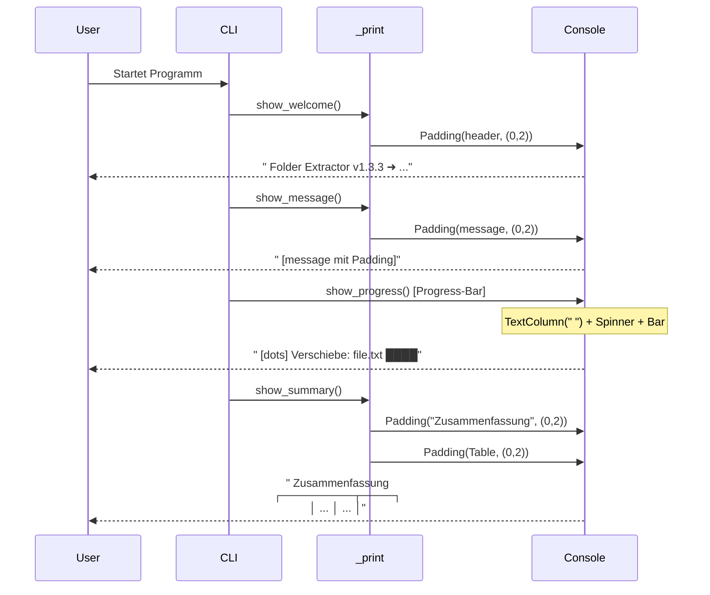

I have created the following plan after thorough exploration and analysis of the codebase. Follow the below plan verbatim. Trust the files and references. Do not re-verify what's written in the plan. Explore only when absolutely necessary. First implement all the proposed file changes and then I'll review all the changes together at the end.

## Beobachtungen

Die aktuelle `ConsoleInterface` in `file:folder_extractor/cli/interface.py` verwendet Rich-Komponenten mit vielen visuellen Elementen: Panel mit Rahmen für den Header, bunte Styles mit Bold-Attributen, und eine Tabelle mit Titel und cyan Border. Alle Ausgaben erfolgen direkt über `self.console.print()` ohne einheitliches Padding. Die Progress-Bar hat keine Abstandsspalte, wodurch sie direkt am linken Rand klebt. Das aktuelle Design wirkt überladen und unruhig.

## Ansatz

Das Redesign folgt einem "Modern Minimalist"-Prinzip: Ein globales Padding-System sorgt für konsistenten Abstand zum linken Rand (2 Spalten), alle Rahmen werden entfernt oder minimiert, und die Farbpalette wird auf dezente Töne reduziert. Die zentrale `_print()` Hilfsmethode kapselt das Padding für alle Ausgaben. Der Header wird zu einer einfachen Textzeile, die Progress-Bar erhält eine unsichtbare Padding-Spalte, und die Tabelle nutzt `box.SIMPLE` ohne Titel. Dies schafft ein ruhiges, professionelles CLI-Interface mit klarer visueller Hierarchie.

## Implementierungsschritte

### 1. Import-Erweiterung

**Datei:** `file:folder_extractor/cli/interface.py`

- Füge in Zeile 12-23 (Import-Bereich) hinzu: `from rich.padding import Padding`
- Füge hinzu: `from rich import box` (für `box.SIMPLE` in der Tabelle)

### 2. Globales Padding-System

**Datei:** `file:folder_extractor/cli/interface.py`

Erstelle eine neue Hilfsmethode in der `ConsoleInterface` Klasse (nach `__init__`, ca. Zeile 81):

```python
def _print(self, renderable, style=None) -> None:
    """Print with consistent left padding."""
    padded = Padding(renderable, (0, 2))
    if style:
        self.console.print(padded, style=style)
    else:
        self.console.print(padded)
```

**Logik:**
- Verpackt jedes `renderable` in `Padding(renderable, (0, 2))` → 0 Zeilen vertikal, 2 Spalten horizontal
- Unterstützt optionale Style-Parameter
- Wird zentrale Ausgabemethode für alle Texte

### 3. Ersetze alle `self.console.print()` Aufrufe

**Datei:** `file:folder_extractor/cli/interface.py`

Durchsuche die gesamte Datei und ersetze systematisch alle direkten `self.console.print()` Aufrufe durch `self._print()`:

**Betroffene Methoden und Zeilen:**

| Methode | Zeilen | Anzahl Aufrufe |
|---------|--------|----------------|
| `show_welcome()` | 88 | 1 |
| `show_message()` | 102, 104, 106, 108, 111 | 5 |
| `confirm_operation()` | 129 | 1 |
| `show_progress()` | 177 | 1 |
| `show_summary()` | 216, 220, 223, 227, 231, 248, 252, 254, 258, 268, 272-275, 279 | ~15 |

**Ausnahmen:**
- `self.console.input()` in Zeile 133 bleibt unverändert (Input-Funktion)
- Progress-Bar-Updates (`self.progress.update()`) bleiben unverändert

### 4. Minimalistischer Header

**Datei:** `file:folder_extractor/cli/interface.py`

Ersetze die `show_welcome()` Methode (Zeilen 82-88):

**Alte Implementierung:**
```python
def show_welcome(self) -> None:
    message = MESSAGES["WELCOME"].format(version=VERSION, author=AUTHOR)
    panel = Panel(message, title="Folder Extractor", border_style="cyan", padding=(1, 2))
    self.console.print(panel)
```

**Neue Implementierung:**
```python
def show_welcome(self) -> None:
    """Show welcome message."""
    # Leerzeile vor Header
    self.console.print()
    
    # Minimalistischer Header ohne Panel
    header = f"Folder Extractor v{VERSION}   ➜ Aufräumen von: {settings.get('target_path', Path.cwd())}"
    self._print(header, style="bold blue")
    
    # Leerzeile nach Header
    self.console.print()
```

**Hinweise:**
- Entferne Panel-Import, falls nicht mehr verwendet
- Der Pfad wird dynamisch aus `settings` geholt oder nutzt `Path.cwd()`
- Leerzeilen vor/nach Header für visuellen Abstand
- Stil "bold blue" für Hervorhebung (passt zum neuen Theme)

### 5. Progress-Bar mit Padding

**Datei:** `file:folder_extractor/cli/interface.py`

Ersetze die Progress-Initialisierung in `show_progress()` (Zeilen 158-168):

**Alte Konfiguration:**
```python
self.progress = Progress(
    SpinnerColumn(),
    TextColumn("[progress.description]{task.description}"),
    BarColumn(),
    TextColumn("[progress.percentage]{task.percentage:>3.0f}%"),
    TimeRemainingColumn(),
    console=self.console,
    transient=True,
)
```

**Neue Konfiguration:**
```python
self.progress = Progress(
    TextColumn("  "),  # Padding-Spalte (2 Leerzeichen)
    SpinnerColumn("dots", style="blue"),  # Minimalistischer Spinner
    TextColumn("[bold]{task.description}"),
    BarColumn(bar_width=40, style="dim white", complete_style="blue"),
    console=self.console,
    transient=True,
)
```

**Änderungen:**
- Erste Spalte: `TextColumn("  ")` für linkes Padding
- Spinner: `"dots"` statt Standard, Style `"blue"`
- Description: `[bold]` statt `[progress.description]`
- BarColumn: `bar_width=40`, dezente Farben (`dim white`, `blue`)
- Entferne `TextColumn` für Prozent und `TimeRemainingColumn` (minimalistischer)

### 6. Clean Theme Styles

**Datei:** `file:folder_extractor/cli/interface.py`

Ersetze die Style-Definitionen in `__init__` (Zeilen 76-80):

**Alte Styles:**
```python
self.success_style = Style(color="green", bold=True)
self.error_style = Style(color="red", bold=True)
self.warning_style = Style(color="yellow")
self.info_style = Style(color="cyan")
```

**Neue Styles:**
```python
self.success_style = Style(color="green")  # Kein Bold
self.error_style = Style(color="red")      # Kein Bold
self.warning_style = Style(color="yellow")
self.info_style = Style(color="white", dim=True)  # "dim white" für Details
self.highlight_style = Style(color="blue", bold=True)  # Für wichtige Elemente
```

**Begründung:**
- Entferne Bold von success/error für ruhigeres Erscheinungsbild
- `info_style` wird zu "dim white" (dezenter)
- Neuer `highlight_style` für wichtige Zahlen/Header

### 7. Minimalistische Tabelle

**Datei:** `file:folder_extractor/cli/interface.py`

Ersetze die Tabellen-Erstellung in `show_summary()` (Zeilen 236-248):

**Alte Implementierung:**
```python
table = Table(
    title="Zusammenfassung", border_style="cyan", show_header=True
)
table.add_column("Kategorie", style="bold")
table.add_column("Anzahl", justify="right")

moved = str(results.get("moved", 0))
dupes = str(results.get("duplicates", 0))
table.add_row("✓ Verschoben", moved, style="green")
table.add_row("⚠ Duplikate", dupes, style="yellow")
table.add_row("✗ Fehler", str(results.get("errors", 0)), style="red")

self.console.print(table)
```

**Neue Implementierung:**
```python
# Überschrift als separate Zeile
self._print("Zusammenfassung", style="bold blue")
self.console.print()  # Leerzeile

# Minimalistische Tabelle
table = Table(box=box.SIMPLE, show_header=True, border_style="dim white")
table.add_column("Kategorie", style="dim white")
table.add_column("Anzahl", justify="right", style="bold")

moved = str(results.get("moved", 0))
dupes = str(results.get("duplicates", 0))
table.add_row("✓ Verschoben", moved, style="green")
table.add_row("⚠ Duplikate", dupes, style="yellow")
table.add_row("✗ Fehler", str(results.get("errors", 0)), style="red")

self._print(table)
```

**Änderungen:**
- Titel wird separate Textzeile mit `_print()` und "bold blue"
- Tabelle nutzt `box=box.SIMPLE` (minimale Linien)
- `border_style="dim white"` statt "cyan"
- Spalten-Styles angepasst: "dim white" für Kategorie, "bold" für Anzahl
- Tabelle wird mit `_print()` ausgegeben für konsistentes Padding

### 8. Weitere Anpassungen

**Datei:** `file:folder_extractor/cli/interface.py`

**In `show_summary()` weitere Ausgaben anpassen:**

- Zeile 252-254 (Erstellte Ordner):
  ```python
  self._print("\nErstellte Ordner:", style="dim white")
  for folder in results["created_folders"]:
      self._print(f"  ✓ {folder}", style="green")
  ```

- Zeile 268-275 (Skipped directories):
  ```python
  self._print(
      MESSAGES["FOLDERS_NOT_REMOVED"].format(count=len(skipped)),
      style="yellow",
  )
  for name, reason in skipped:
      self._print(
          MESSAGES["FOLDER_SKIP_REASON"].format(name=name, reason=reason),
          style="dim white",
      )
  ```

**Style-Anpassungen:**
- Ersetze `style="dim"` durch `style="dim white"` für Konsistenz
- Nutze `self.info_style` wo passend

### 9. Visuelle Darstellung



### 10. Zusammenfassung der Änderungen

| Komponente | Vorher | Nachher |
|------------|--------|---------|
| **Padding** | Kein globales System | Konsistent 2 Spalten links via `_print()` |
| **Header** | Panel mit Rahmen, cyan | Einfache Textzeile, bold blue |
| **Progress** | Direkt am Rand | Padding-Spalte + dezente Farben |
| **Styles** | Bold green/red, cyan | green/red, dim white, bold blue |
| **Tabelle** | Titel im Table, cyan border | Separate Überschrift, box.SIMPLE |
| **Ausgaben** | `console.print()` | `_print()` mit Padding |

**Erwartetes Ergebnis:**
- Alle Ausgaben haben 2 Leerzeichen Abstand zum linken Rand
- Keine störenden Rahmen mehr (außer minimale Tabellenlinien)
- Dezente Farbpalette (grün, rot, blau, dim white)
- Ruhiges, professionelles Erscheinungsbild
- Konsistente visuelle Hierarchie durch Whitespace